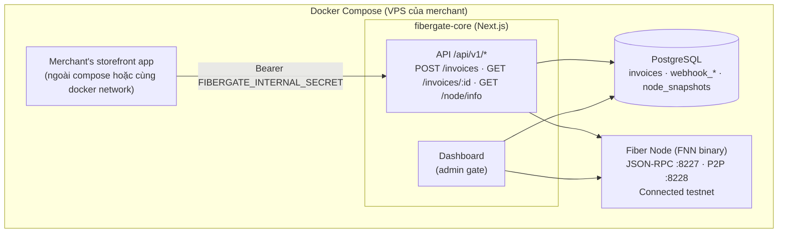
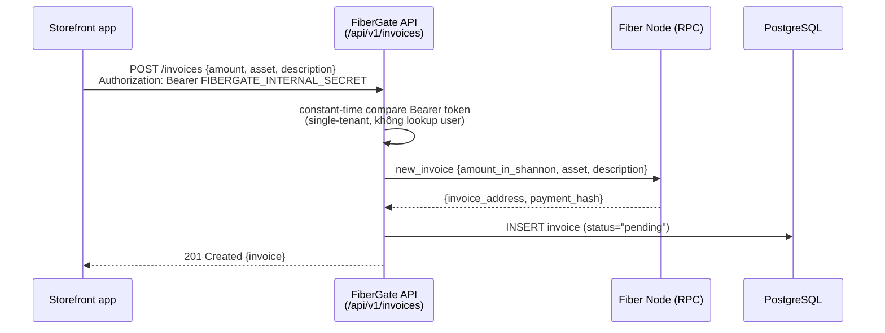
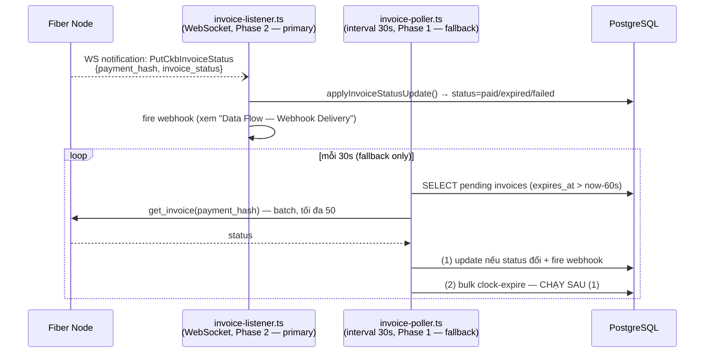
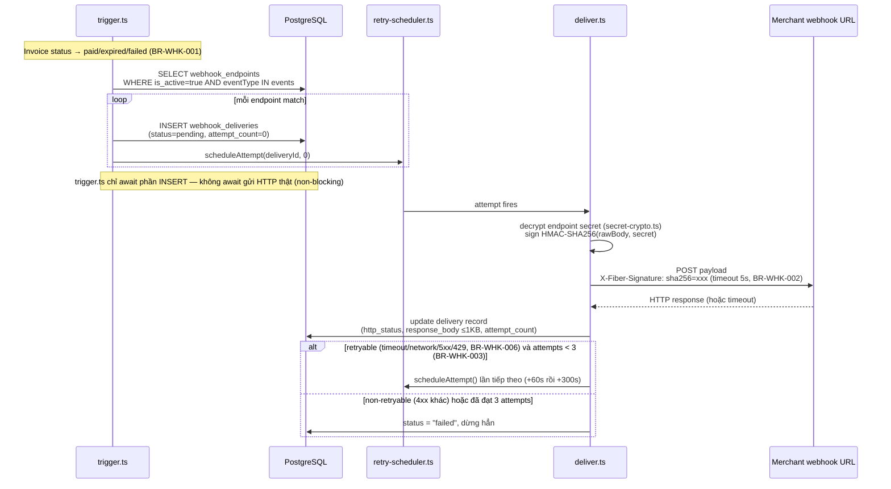

# System Design — FiberGate

> Phần diagram (Overview, Data Flow) có bản public (VitePress): `docs/architecture.md`.
> Sửa 1 trong 2 file thì kiểm tra file còn lại trong cùng lần sửa (xem
> `.context/INDEX.md`'s "Public docs mirror").

## Tech Stack

| Layer | Technology | Lý do |
|-------|-----------|-------|
| Frontend + API | Next.js 14 App Router | Full-stack, chạy như 1 container dài hạn (không serverless) |
| Database | PostgreSQL (container riêng) + Drizzle ORM | Nhẹ, không cần Auth/Realtime/Storage/Kong như Supabase self-hosted — khớp mục tiêu docker-compose gọn |
| Styling | Tailwind CSS + Antd | Nhanh, đẹp, component ready |
| SDK package | TypeScript + tsup | Zero-config bundler, ESM+CJS |
| Fiber Node | FNN binary | Container riêng trong cùng docker-compose |
| Fiber client library | `@ckb-ccc/fiber` (official SDK) | Dùng trong `lib/fiber/client.ts` để gọi RPC tới fiber-node — "best starting point for app integrations" theo tài liệu hackathon; không dùng `@fiber-pay/sdk` (community) cho core flow |
| WebSocket client (Phase 2) | `ws` (dep của `apps/web`, issue #13) | `lib/fiber/subscribe-client.ts` — `@ckb-ccc/fiber` không hỗ trợ subscription (xem trên); Node 20 (base image pinned trong `docker/fibergate-core/Dockerfile`) chưa có global `WebSocket` (chỉ có từ Node 22 trở lên), nên cần package riêng thay vì tự viết RFC6455 hay bump base image — human chốt trực tiếp trong hội thoại giữa 3 lựa chọn |
| Hosting | Docker Compose | Merchant tự deploy trên VPS của họ (`docker compose up -d`) |
| Package manager | pnpm workspaces | Monorepo standard |
| Dev tooling | `dotenv-cli` (dep của `apps/web`) | `pnpm dev`'s script dùng để merge root `.env` + `apps/web/.env.local`, tránh duplicate secret giữa 2 file — xem mục Environment Variables |
| Dev tooling | `vitest` (devDep của cả `apps/web` và `packages/sdk`) | `apps/web`: unit test 2 tầng — `lib/services/*.test.ts` mock ở boundary `@/lib/db` + `@/lib/fiber/client`; `app/api/v1/**/route.test.ts` mock ở boundary `@/lib/services/*` (`pnpm --filter web test:unit`). `packages/sdk`: `webhooks.test.ts` verify HMAC edge cases, `client.test.ts` mock global `fetch` (`pnpm --filter sdk test:unit`) — 2 package.json khai báo version riêng (cùng `^4.1.9`, tự dedupe qua pnpm content-addressable store), không hoist lên root |
| Dev tooling | `@usebruno/cli` (devDep của `apps/web`) | HTTP integration test chạy qua `bru run` nhắm vào `/api/v1/*` thật — collection tại root `bruno/` (`pnpm --filter web test:integration`) |

## Kiến trúc tổng thể



Mọi giao tiếp trong sơ đồ trên đi qua docker internal network — không service nào
publish public port ngoại trừ qua `nginx` (xem "TLS/WSS reverse proxy" bên dưới).

**"Merchant's storefront app" cụ thể hoá (issue #12):** `apps/demo-storefront` là bản
implement thật của box này — 1 workspace app hoàn toàn tách biệt khỏi `apps/web`
(không import code chung, không chung process/container), gọi `POST /api/v1/invoices`
qua `@fibergate/sdk` đúng như 1 merchant thứ ba thật sẽ làm, dùng `FIBERGATE_BASE_URL` +
`FIBERGATE_INTERNAL_SECRET` để trỏ tới `fibergate-core`. Nhận webhook thật ở
`POST /api/webhook` (verify bằng `@fibergate/sdk`'s `verifyWebhookSignature()`), đẩy
update qua Server-Sent Events cho browser — không polling. Deploy tách biệt qua overlay
`apps/demo-storefront/docker-compose.demo.yml` (Dockerfile + compose overlay nằm ngay
trong thư mục app, tự chứa hoàn toàn — không thuộc bundle 3-container merchant-facing
gốc ở `docker-compose.yml`/`docker/`). Xem `docs/merchants/demo-storefront.md` để biết cách
chạy local.

## Data Flow — Tạo Invoice



Sau khi tạo, invoice chuyển trạng thái qua 1 trong 2 cơ chế song song (Phase 2 là
primary, Phase 1 là fallback — không tắt hẳn):



Thứ tự (1) rồi mới (2) trong vòng lặp Poller là **bắt buộc** (BR-STS-002(b)): bulk
clock-expire không gọi RPC, chỉ dựa vào đồng hồ — chạy trước sẽ có thể đánh dấu
`expired` nhầm 1 invoice vừa được trả tiền đúng lúc hết hạn (status chỉ chuyển 1
chiều, BR-STS-001, không có đường quay lại `paid`). Chi tiết RPC batch: BR-POL-002/003.
Listener implemented + live-verified 2026-07-13 (issue #13) — xem "Phase 2 —
Real-time Invoice Listener" ngay dưới.

## Phase 2 — Real-time Invoice Listener (đã verify với source code FNN, xem `decisions-log.md`)

**Cơ chế:** FNN có sẵn RPC module `pubsub`, method `subscribe_store_changes` (unsubscribe qua
`unsubscribe_store_changes`, notification topic `store_changes`), dùng `jsonrpsee` WebSocket
subscription — xác nhận tồn tại từ bản stable v0.8.1 trở đi, và có document chính thức tại
`fiber.world/docs/api-reference#websocket-subscriptions`. Node bắn `StoreChange::PutCkbInvoiceStatus
{ payment_hash, invoice_status }` mỗi khi invoice status đổi — đúng event Phase 2 cần.

**2 gotcha phát hiện lúc live-verify (2026-07-13, chạy thật `nervos/fiber:0.9.0-rc6`, xem
`decisions-log.md`) — không có trong doc chính thức, phải verify bằng cách đọc source thật + connect
thật:**
- **`pubsub` KHÔNG nằm trong `rpc.enabled_modules` mặc định của FNN** (default xác nhận qua
  `crates/fiber-lib/src/rpc/config.rs` tại tag `v0.9.0-rc6`:
  `cch,channel,graph,payment,info,invoice,peer`) — thiếu bước này thì `subscribe_store_changes` không
  tồn tại trên node luôn, không phải lỗi auth hay lỗi khác. `docker/fiber-node/config.yml`'s `rpc:`
  giờ có thêm `enabled_modules:` liệt kê đủ toàn bộ default list + `pubsub` (set field này trong
  config.yml THAY THẾ hoàn toàn default chứ không cộng dồn, nên phải liệt kê lại từ đầu, không chỉ
  thêm `pubsub` một dòng).
- **Subscription id trả về là JSON *number*, không phải string** (vd `2883300409120665`) — mọi ví dụ
  jsonrpsee subscription tổng quát trên mạng đều minh hoạ bằng string, khiến bản đầu tiên của
  `lib/fiber/subscribe-client.ts` (chỉ check `typeof result === "string"`) không bao giờ resolve khi
  chạy thật, dù unit test (tự bịa response string) vẫn pass — phát hiện được nhờ chạy live handshake
  thật qua `docker run` + script `ws` trước khi coi issue #13 là xong, đúng tinh thần "verify against
  real infra" của project này. Đã sửa: chấp nhận cả `string | number` cho subscription id.

**Ràng buộc cần biết trước khi implement:**
- Doc chính thức ghi rõ: *"primarily intended for Cross-Chain Hub integration rather than general
  client use"* — cơ chế này chính thức tồn tại và ổn định, nhưng Nervos framing mục đích là cho CCH,
  không phải cho use case invoice-webhook như FiberGate. Dùng được về mặt kỹ thuật, nhưng coi đây là
  "off-label usage" — vẫn giữ Phase 1 poller làm fallback (giảm tần suất xuống 30-60s) phòng khi cơ
  chế này đổi hành vi giữa các bản release.
- Stream trả về TẤT CẢ `StoreChange` (bao gồm `PutPreimage`, `PutPaymentSession`, `PutAttempt`),
  không lọc theo payment_hash — fibergate-core phải tự lọc: chỉ xử lý `PutCkbInvoiceStatus`, và chỉ
  những `payment_hash` có trong bảng `invoices` nội bộ.
- Nếu Biscuit auth được bật trên node (`FIBER_NODE_RPC_AUTH_TOKEN` set), token cần thêm permission
  `read("cch")` để gọi được `subscribe_store_changes`. `fnn` chỉ bắt buộc Biscuit khi
  `rpc.listening_addr` là địa chỉ nó tự phân loại "public" (loopback/private/link-local mới được coi
  là an toàn — **`0.0.0.0` KHÔNG nằm trong nhóm an toàn này dù chỉ nghe nội bộ**, xem gotcha đã ghi ở
  `decisions-log.md` 2026-07-02). FiberGate né yêu cầu này bằng cách bind `fiber-node` vào 1 static
  private IP (`172.28.0.10`, xem mục "fiber-node container" bên dưới) thay vì `0.0.0.0` — IP thuộc
  dải RFC1918 nên `fnn` coi là "private", Biscuit auth vẫn tắt hoàn toàn, ràng buộc `read("cch")`
  không phát sinh trong setup mặc định.
- **`@ckb-ccc/fiber` (SDK chính thức đang dùng cho các RPC call khác) KHÔNG hỗ trợ subscription**
  (đã verify bằng cách tải source thật từ npm: `FiberClient` chỉ wrap `ccc.RequestorJsonRpc`, thuần
  request/response, không có dòng nào liên quan "subscribe"/"websocket"). → Cần viết 1 WebSocket
  JSON-RPC client nhỏ, riêng, chỉ để gọi `subscribe_store_changes`/nhận notification `store_changes`,
  song song với `@ckb-ccc/fiber` cho các RPC call thông thường khác trong `lib/fiber/client.ts`.

## Data Flow — Webhook Delivery



Payload shape: `api/rest-api-spec.md`'s "Webhook Payload". Key ký HMAC luôn là
`webhook_endpoints.secret` **riêng theo từng endpoint** (mã hoá at rest bằng
`WEBHOOK_SECRET_ENCRYPTION_KEY`, xem "Environment Variables"), không phải 1 global
signing key — và retry là schedule cố định (`immediate → 1 phút → 5 phút`,
BR-WHK-003), không phải exponential backoff.

## Monorepo Structure

```
fibergate/
├── apps/
│   └── web/                    ← Next.js app (fibergate-core)
│       ├── app/
│       │   ├── (dashboard)/    ← Protected routes (single-admin password gate)
│       │   │   ├── dashboard/
│       │   │   ├── webhooks/
│       │   │   └── transactions/
│       │   ├── api/
│       │   │   ├── v1/
│       │   │   │   ├── invoices/
│       │   │   │   └── node/
│       │   │   └── cron/       ← Optional: manual-trigger poll endpoint (không phải nguồn chính)
│       │   └── login/          ← Single-admin password gate
│       ├── lib/
│       │   ├── db/             ← Drizzle client + schema + helpers
│       │   └── fiber/          ← Fiber RPC client
│       └── components/
├── packages/
│   └── sdk/                    ← @fibergate/sdk
│       ├── src/
│       │   ├── index.ts
│       │   ├── client.ts
│       │   ├── types.ts
│       │   └── webhooks.ts
│       └── package.json
├── docker/                     ← Dockerfile cho fibergate-core, config fiber-node
├── docker-compose.yml          ← Fiber node + PostgreSQL + fibergate-core
├── .context/                   ← Context files (file này)
├── .claude/
│   └── CLAUDE.md
├── pnpm-workspace.yaml
└── package.json
```

## Environment Variables

Bảng đầy đủ toàn bộ biến (theo từng file `.env.example`): xem
`.context/architecture/env-vars.md` — mục này chỉ giữ lại các quyết định
kiến trúc/current-state không tự nhiên nằm gọn trong 1 bảng.

Không có `DATABASE_URL` ở bất kỳ đâu — `lib/db/` luôn tự build connection string từ
5 biến `POSTGRES_*` trước khi khởi tạo Drizzle client, 1 code path duy nhất dùng
chung cho cả Docker lẫn local dev:

```ts
const databaseUrl = `postgres://${process.env.POSTGRES_USER}:${process.env.POSTGRES_PASSWORD}@${process.env.POSTGRES_HOST}:${process.env.POSTGRES_PORT}/${process.env.POSTGRES_DB}`
```

**Chỉ 1 file chứa secret thật** — root `.env` (copy từ `.env.example`), dùng chung
cho cả `docker compose up -d` lẫn `pnpm dev`. Cách generate: merchant path →
`create-fibergate` (`docs/merchants/quickstart.md`); contributor/from-source path →
`pnpm generate:env` (`docs/maintainers/getting-started.md`'s "Generating a real
`.env`"). Không có preflight nào tự động kiểm tra các biến bcrypt/secret (postgres/
fibergate-core tự fail rõ ràng nếu thiếu) — riêng `DOMAIN` có `nginx-certs-preflight`
sinh cert self-signed tạm nếu thiếu cert thật.

`apps/web/.env.local` chỉ override 3 biến khác giá trị so với root `.env` khi chạy
`pnpm dev` ngoài Docker (`POSTGRES_HOST`, `POSTGRES_PORT`, `FIBER_NODE_URL`) —
`apps/web/package.json`'s `dev` script dùng `dotenv-cli` để merge 2 file trước khi
spawn `next dev`: `dotenv -e .env.local -e ../../.env -- next dev` (file liệt kê
trước thắng). `POSTGRES_HOST=localhost` chỉ hoạt động vì `docker-compose.yml`'s
`postgres` service publish port loopback-only (`127.0.0.1:5432`) — cùng pattern
dùng cho `fiber-node`'s RPC (xem section "fiber-node container" bên dưới).

`apps/demo-storefront` có `.env.local` hoàn toàn độc lập (`FIBERGATE_BASE_URL`,
`FIBERGATE_INTERNAL_SECRET`, `DEMO_WEBHOOK_SECRET`) — không đọc root `.env` hay
`apps/web`'s vars, kể cả khi deploy qua Docker Compose overlay
(`apps/demo-storefront/docker-compose.demo.yml` dùng `env_file:` để đọc thẳng từ
file đó, chỉ override đúng `FIBERGATE_BASE_URL` qua `environment:` cho khớp docker
DNS name).

Lịch sử các quyết định/gotcha liên quan (biến `FIBER_NODE_RPC_AUTH_TOKEN` chưa gắn
được vào request thật ở bản SDK đang pin; `DOMAIN`/`CERTBOT_EMAIL` trở thành
required khi thêm nginx/certbot; tách `.env` riêng cho demo-storefront; Docker
Compose không tự forward `.env` vào container; `env_file:` resolve path theo
project directory): xem `decisions-log.md` và `.context/processes/gotchas.md`.

## fiber-node container (docker-compose)

Deployment details chốt khi implement issue #3 (xem `decisions-log.md` để biết lý do):

- Image: official `nervos/fiber` (Docker Hub) / `ghcr.io/nervosnetwork/fiber` (GHCR
  mirror), hiện pin `nervos/fiber:0.9.0-rc6` — repo image chưa publish tag semver ổn
  định nào (chỉ có `0.9.0-rc1`..`rc6` prerelease + `sha-<hash>`), cần revisit khi có
  stable tag.
- Image tự động copy bundled **testnet** config vào `/fiber/config.yml` lúc first-run
  nếu file chưa tồn tại (đừng set `FIBER_CONFIG_TEMPLATE` — biến đó chuyển sang mainnet
  config). FiberGate pre-seed sẵn `docker/fiber-node/config.yml` thay vì để image tự
  generate, để repo state đúng ngay từ đầu.
- **Gotcha quan trọng**: RPC listener trong bundled config mặc định bind
  `127.0.0.1:8227` (chỉ loopback trong container) — `fibergate-core` (container khác) không gọi
  được qua đó. **KHÔNG sửa thành `0.0.0.0:8227`** — tưởng hợp lý nhưng `fnn` (bản đang pin
  `0.9.0-rc6`) tự phân loại `0.0.0.0` là địa chỉ "public" (chỉ loopback/private/link-local mới được
  coi "an toàn") và **từ chối start** nếu không có `rpc.biscuit_public_key`
  (lỗi: `Cannot listen on a public address without a biscuit public key set in the config`) — phát
  hiện lúc chạy live thật lần đầu, xem tường thuật đầy đủ ở `decisions-log.md` 2026-07-02. Cách đúng:
  gán `fiber-node` 1 **static private IP** trên network `fibergate-net` (`docker-compose.yml`'s
  `networks.fibergate-net.ipam.config.subnet: 172.28.0.0/24` +
  `fiber-node.networks.fibergate-net.ipv4_address: 172.28.0.10`), rồi set
  `rpc.listening_addr: 172.28.0.10:8227` — IP thuộc dải RFC1918 nên `fnn` coi là "private", pass
  check mà không cần Biscuit, vẫn chỉ reachable trong docker network nội bộ như cũ. Hệ quả kéo theo:
  healthcheck `fnn-cli info` (chạy trong chính container, mặc định trỏ `127.0.0.1`) phải đổi thành
  `fnn-cli -u http://172.28.0.10:8227 info` vì loopback không còn reach được RPC.
- Node cần `FIBER_SECRET_KEY_PASSWORD` (env) + CKB private key file mount tại
  `<data-dir>/ckb/key` (data dir mount ở container path `/fiber`) — đây là secret ký
  CKB của merchant tự cung cấp. `FIBER_SECRET_KEY_PASSWORD` **không** thuộc 8 biến
  app-level ở `.env.example` phía trên (chỉ `fiber-node` đọc, không phải code
  `fibergate-core`), nhưng vẫn có mặt trong `.env.example` — ở section riêng, tách
  biệt khỏi 8 biến app — để merchant không bỏ sót khi chỉ làm theo 1 bước
  `cp .env.example .env`. Quyết định UX này đổi từ thiết kế ban đầu (cố tình loại
  hẳn khỏi `.env.example`), xem `decisions-log.md`.
- Image có sẵn `fnn-cli`, dùng được cho healthcheck (`fnn-cli info`) mà không cần cài
  thêm curl/wget.
- RPC được publish ra host ở dạng **loopback-only**: `ports: "127.0.0.1:8227:8227"`
  trong `docker-compose.yml`. Lý do: `pnpm dev` (chạy `apps/web` trực tiếp trên host,
  không qua Docker) cần gọi được `fiber-node` mà không phải sửa `/etc/hosts` hay thêm
  `docker-compose.override.yml`. Khác hẳn `"8227:8227"` thường (mặc định bind
  `0.0.0.0`, sẽ lộ RPC chưa bật auth ra internet nếu host có IP public) —
  `127.0.0.1:8227:8227` không bao giờ lộ ra ngoài chính máy đang chạy, dù máy đó là
  laptop hay VPS có IP public, nên vẫn khớp đúng yêu cầu "fiber-node does NOT bind a
  public IP/port" của issue #3. Đã verify: `docker compose ps` hiện đúng
  `127.0.0.1:8227->8227/tcp`, `ss -tlnp` xác nhận socket chỉ LISTEN trên `127.0.0.1`.

## Dashboard auth: session cookie + middleware guard (issue #9)

`apps/web/middleware.ts` guard mọi route dưới `app/(dashboard)/**` bằng session cookie
JWT (ký qua `jose`, secret `DASHBOARD_SESSION_SECRET`, xem `apps/web/lib/auth/session.ts`).
Login/logout là Next.js Server Action (`app/login/actions.ts`), không phải route
`/api/*` — không đi qua envelope `{data,error}` (envelope đó chỉ áp dụng cho `/api/v1/*`,
xem `api/rest-api-spec.md`).

- **Gotcha quan trọng — `middleware.ts`'s `config.matcher` phải là literal, không được
  import từ file khác**: Next.js static-extract `config` lúc build bằng AST parser giới
  hạn, chỉ resolve được giá trị literal khai ngay tại chỗ, không resolve được identifier
  import từ module khác. Ban đầu matcher được tách ra `lib/auth/routes.ts` (`PROTECTED_PATH_MATCHERS`)
  cho gọn — verify bằng `next build` thật thấy warning `"Next.js can't recognize the
  exported 'config' field... The default config will be used instead"` — nghĩa là guard
  bị tắt hoàn toàn, middleware chạy trên **mọi** route thay vì chỉ 3 route đã định.
  Hậu quả nếu không phát hiện: `/login` tự guard chính nó → infinite redirect loop; mọi
  request `/api/v1/*`/`/api/cron/*` (auth qua Bearer header, không phải session cookie)
  bị chặn nhầm redirect về `/login`. Fix: matcher array inline trực tiếp trong
  `middleware.ts`'s `config` export, `lib/auth/routes.ts` chỉ còn giữ `ROUTE.LOGIN`/
  `ROUTE.DASHBOARD` (dùng ở runtime bên trong function body, không phải static config,
  nên import bình thường không sao). Route group `(dashboard)` không xuất hiện trong URL
  nên matcher là allowlist thủ công liệt kê từng subroute hiện có
  (`/dashboard`, `/webhooks`, `/transactions`) — thêm page mới dưới `(dashboard)/` phải
  tự thêm path pattern vào matcher này, không tự động được guard.
- **Cookie `Secure` flag dựa vào `X-Forwarded-Proto` header, không dựa vào
  `NODE_ENV`**: `docker/fibergate-core/Dockerfile` hardcode `NODE_ENV=production`, nhưng
  `fibergate-core` tự nó không làm TLS termination — `apps/web/lib/auth/session.ts`'s
  `isHttpsRequest()` đọc header `X-Forwarded-Proto` thay vì `NODE_ENV==="production"`,
  không có header thì `secure: false`. **Cập nhật 2026-07-09 (issue #17)**: giờ đã có
  TLS termination thật — `nginx` (service mới trong `docker-compose.yml`, xem mục
  "TLS/WSS reverse proxy (nginx + certbot)" ngay dưới) set đúng
  `X-Forwarded-Proto: https` khi forward tới `fibergate-core:3000`, nên `secure: true`
  giờ là hành vi thật trên deploy mặc định, không còn là "nếu sau này thêm proxy" nữa.
  Đi kèm: `fibergate-core`'s port publish đã đổi từ `"3000:3000"` sang
  `"127.0.0.1:3000:3000"` (loopback-only, đúng như dự đoán trước đó) — không publish
  trực tiếp ra host nữa, `nginx` là entry point công khai duy nhất, tránh ai đó gọi
  thẳng `http://host:3000` bỏ qua nginx để tự set header giả đánh lừa cookie.

### Admin password: DB-backed with env-var seed (issue #30)

Login itself (`app/login/actions.ts`'s `login()`) không đổi hành vi — vẫn `bcrypt.compare`
password nhập vào với 1 hash duy nhất. Cái đổi là **hash đó lấy từ đâu**:
`getAdminPasswordHash()` (`lib/services/settings.ts`) đọc bảng `settings` (key
`admin_password_hash`) trước; nếu chưa có row nào (deployment mới, hoặc chưa từng đổi
password qua Dashboard) → fallback đọc `ADMIN_PASSWORD_HASH_B64` y hệt logic cũ (decode
base64). Nói cách khác, env var giờ chỉ **seed giá trị ban đầu** — ngay khi admin đổi
password lần đầu qua `/settings` (`setAdminPassword()`, bcrypt cost 10 — cùng cost
factor `create-fibergate` dùng nội bộ qua `bcryptjs` lúc scaffold), 1 row được upsert
vào `settings` và **từ đó DB luôn thắng**, env
var không bao giờ được đọc lại nữa cho deployment đó (không có cơ chế nào xoá row để
"quay lại" đọc env var — nếu cần reset, phải `DELETE FROM settings WHERE key =
'admin_password_hash'` thủ công qua psql).

`/settings` (route mới, `app/(dashboard)/settings/`) nằm sau cùng 1 session-cookie guard
với mọi route `(dashboard)` khác (`middleware.ts`'s `config.matcher`, đã thêm
`/settings/:path*`) — đổi password bắt buộc đang có session hợp lệ (đã login), và Server
Action `changePassword()` (`app/(dashboard)/settings/actions.ts`) bắt buộc nhập đúng
current password trước khi cho đổi (so sánh qua `getAdminPasswordHash()` +
`bcrypt.compare`), tránh 1 session bị chiếm (tab quên đăng xuất, máy không khoá) đổi
password mà admin thật không hay biết.

### TLS/WSS reverse proxy (nginx + certbot) — issue #17

`docker-compose.yml` có thêm 3 service: `nginx-certs-preflight` (one-shot, sinh cert
self-signed tạm nếu chưa có cert thật, để `nginx` start được lần đầu — cùng tinh thần
với `fiber-node-preflight`), `nginx` (`nginx:1.27-alpine` bản chính thức, **không cần
custom build** — đã verify `nginx -V` có sẵn `--with-stream`/`--with-stream_ssl_module`/
`--with-stream_ssl_preread_module` compiled tĩnh), và `certbot` (renew loop, issuance
lần đầu là lệnh thủ công 1 lần — xem `docs/merchants/public-https-deploy.md`). `nginx` là
service DUY NHẤT publish host port công khai thật (`80`, `443`, `8228`) — `postgres`/
`fiber-node`/`fibergate-core` đều giữ nguyên loopback-only.

Kiến trúc `nginx.conf.template` (`docker/nginx/`, templated bằng `envsubst '$DOMAIN'`
lúc container start — chỉ đúng 1 biến, tránh envsubst ăn nhầm `$variables` runtime của
chính nginx, cùng class bug với gotcha `$`-escaping của Docker Compose đã ghi ở
`decisions-log.md` 2026-07-02):
- `:80` — ACME HTTP-01 challenge (webroot) + redirect sang https.
- `:443 ssl` — dashboard/API, `proxy_pass` sang `fibergate-core:3000`, set
  `X-Forwarded-Proto: https`.
- `127.0.0.1:8443 ssl` (internal-only, không publish ra host) — terminate TLS, proxy
  WebSocket-upgrade sang `fiber-node:8228` (plain P2P port bên trong container, không
  đổi gì ở đó).
- `stream{}` block trên `:8228` (public) — dùng `ssl_preread` để phân biệt: TLS
  ClientHello (WSS, từ browser wallet) → forward sang `127.0.0.1:8443` ở trên; không
  phải TLS (raw TCP, P2P node thường) → forward thẳng `fiber-node:8228`. Kỹ thuật này
  copy nguyên từ tài liệu chính thức `nervosnetwork/fiber`'s `docs/fiber-node-wss.md`
  (pin đúng tag `v0.9.0-rc6`, khớp image `nervos/fiber:0.9.0-rc6` đang dùng), chỉ đổi
  số port cho khớp Docker networking của project này (bản gốc dùng chung port `443`
  cho cả 2 mục đích; project này tách riêng `:443` cho dashboard và `:8228` cho P2P/WSS
  vì cần `:443` sạch cho dashboard).

`fiber-node`'s P2P listener (`fiber.listening_addr: "/ip4/0.0.0.0/tcp/8228"` trong
`docker/fiber-node/config.yml`) không đổi gì — đã bind `0.0.0.0` sẵn bên trong network
namespace riêng của chính container đó, `nginx` reach qua Docker network nội bộ
(`fiber-node:8228`), không có host port nào publish trực tiếp cho port này (khác hẳn
RPC's `172.28.0.10:8227` — port P2P không bị fnn's "public address refusal" check chi
phối, chỉ RPC mới bị). `announced_addrs` là chỗ duy nhất cần sửa thủ công (file này
`fiber-node` đọc trực tiếp, không qua Docker Compose interpolation) để thêm
`/dns4/<DOMAIN>/tcp/8228/wss` — xem comment trong chính file đó.

**Scope quyết định**: `nginx` chỉ front `fibergate-core` (dashboard/API + P2P/WSS của
`fiber-node`), KHÔNG front `apps/demo-storefront` (app tách biệt hoàn toàn, compose
overlay riêng) — giữ đúng scope gốc của issue #17. Nginx+certbot cũng được gộp thẳng
vào root `docker-compose.yml` (không phải overlay tùy chọn) — nghĩa là **mọi**
`docker compose up -d` từ giờ cần `DOMAIN`/`CERTBOT_EMAIL` trong `.env` và port
80/443/8228 mở ra internet mới thực sự dùng được qua HTTPS (dù container vẫn start
được với cert self-signed tạm nếu thiếu). Đây là thay đổi so với mô hình "mỗi merchant
chỉ cần `docker compose up -d`, không cần domain" đã ngầm định trước đó — xem
`decisions-log.md` 2026-07-09 để biết lý do human chọn hướng này.
- **`ADMIN_PASSWORD_HASH_B64` lưu base64, không phải raw bcrypt hash — 2 cơ chế load
  `.env` khác nhau corrupt ký tự `$` theo 2 kiểu khác nhau, không có cách escape nào
  thoả cả hai** (phát hiện lúc human tự test `pnpm dev` login sau khi PR #32 merge, xem
  `decisions-log.md` 2026-07-05 để biết toàn bộ quá trình điều tra): Root `.env` được
  dùng chung cho cả `docker compose up -d` (Docker Compose tự interpolate `$VAR`/`${VAR}`
  bên trong giá trị `.env`, coi `$$` là escape cho 1 dấu `$` literal) lẫn `pnpm dev`/`build`/
  `db:generate`/`db:migrate` (qua `dotenv-cli`, dùng `dotenv-expand` bên trong — cũng tự
  interpolate `$VAR` nhưng theo thuật toán khác, KHÔNG coi `$$` là escape cho 1 dấu `$`).
  Đã verify bằng container thật (`docker compose run --rm test printenv TESTVAR`, không chỉ
  tin `docker compose config`'s output — lệnh đó tự re-escape `$` lúc hiển thị nên trông có
  vẻ đúng dù giá trị runtime thật sai) và bằng `npx dotenv-cli -- node -e "console.log(...)"`:
  không có bất kỳ cách viết `$`/`$$`/`\$` nào trong `.env` cho ra đúng giá trị ở **cả 2** cơ
  chế cùng lúc — escape đúng cho bên này luôn sai ở bên kia. Đã thử thêm `--no-expand` flag
  của `dotenv-cli` và `env_file:` directive của Docker Compose (thay cho `environment: ${VAR}`
  hiện tại) — không giải quyết được, vì Docker Compose vẫn tự interpolate giá trị đọc từ
  `env_file:` giống hệt cách nó làm với root `.env`. Fix: `ADMIN_PASSWORD_HASH_B64` lưu
  base64 của hash gốc (bảng chữ base64 không có ký tự `$`), `app/login/actions.ts` decode lại
  bằng `Buffer.from(value, "base64").toString("utf-8")` trước khi `bcrypt.compare()` — cả 2
  cơ chế load `.env` đều pass-through base64 nguyên vẹn, không cần escape gì cả. Đánh đổi đã
  biết: đây là fix tạm thời cho model env-var-only hiện tại — nếu/khi issue #30 (chuyển
  `ADMIN_PASSWORD_HASH` sang DB-backed) triển khai, vấn đề này biến mất hoàn toàn cho việc
  verify hàng ngày (Postgres/Drizzle không quan tâm ký tự `$`), chỉ còn lại đúng 1 lần lúc
  seed dữ liệu ban đầu cần thiết kế riêng (không nên tái dùng nguyên si cơ chế env-var này
  cho bước seed).

  > **Cập nhật 2026-07-11**: issue #30 đã triển khai đúng như dự đoán ở trên — xem
  > "Admin password: DB-backed with env-var seed" phía trên.

## Published image + release compose (issues #21, #41)

`fibergate-core` giờ có 2 đường build/deploy song song, không thay thế nhau:

- **`docker-compose.yml` (root)**: build từ source (`build:` block), dành cho
  contributor/dev — cần clone monorepo.
- **`docker-compose.release.yml` (mới)**: `fibergate-core` dùng
  `image: ghcr.io/${GHCR_NAMESPACE}/fibergate-core:${FIBERGATE_CORE_TAG:-latest}` thay
  cho `build:` — merchant chỉ cần file này + `docker/fiber-node/config.yml` +
  `docker/nginx/nginx.conf.template` + `.env` (từ `.env.release.example`), không cần
  clone repo. Cùng 6 service như bản gốc (không có `fiber-node-payer`, dev-only) — xem
  `docs/merchants/quickstart.md` (CLI) / `docs/merchants/deployment.md` (manual).

**Registry: GHCR (`ghcr.io`), không phải Docker Hub** — lệch với gợi ý ban đầu trong
issue #41's body, đổi theo quyết định trực tiếp với human khi implement (xem
`decisions-log.md` 2026-07-11): không cần tài khoản bên thứ 3, `GITHUB_TOKEN` có sẵn
trong GitHub Actions dùng được luôn, không cần tự tạo secret nào.

**Tagging: git commit SHA** (`sha-<short-sha>`, issue #21's "reproducible deploys" —
merchant có thể pin `FIBERGATE_CORE_TAG` về 1 build cụ thể thay vì luôn theo
`latest`), cộng 1 tag `latest` nổi theo HEAD của `canary`. Build + push tự động qua
`.github/workflows/docker-publish.yml` — trigger `push` vào `canary` + `workflow_dispatch`
(test thủ công trước khi tin tưởng trigger tự động). Không dùng semver — không có quy
trình version-bump/changelog nào đi kèm ở scope hackathon hiện tại, SHA đã đủ để truy
ngược đúng commit.

> **Cập nhật 2026-07-12**: lần chạy CI thật đầu tiên fail 2 lần liên tiếp, cả 2 đều là
> gotcha về build image Docker trong CI (khác hẳn build local, vốn luôn có sẵn
> `.env`/`apps/web/.env.local` của người chạy) — đã fix cả 2, chi tiết đầy đủ + cách
> verify xem `decisions-log.md` 2026-07-12. **Live-verify xong**: `gh run list
> --workflow=docker-publish.yml` xác nhận 2 lần chạy gần nhất trên `canary` đều
> `success`; human tự tay `docker compose -f docker-compose.release.yml up -d` với
> image thật đã pull được từ GHCR và chạy thành công (issue #48 testing) — package
> visibility gotcha có thật, đã gặp: đổi repo GitHub sang public **không** tự động
> đổi visibility của package GHCR theo, phải vào riêng repo → Packages →
> `fibergate-core` → Package settings → Public.
>
> **create-fibergate CLI (issue #48)** giờ là đường khuyến nghị để lấy 4 file này
> (`docker-compose.release.yml`, `docker/fiber-node/config.yml`,
> `docker/nginx/nginx.conf.template`, `.env.release.example` → `.env`) thay vì tự
> `curl` từng file thủ công — xem `packages/create-fibergate/`,
> `docs/merchants/quickstart.md`. `docs/merchants/deployment.md` giữ lại đường thủ
> công (hand-edit file CLI sinh ra, hoặc chạy CLI ở máy khác rồi `scp` sang host
> không có Node.js) — không còn 1 flow curl-3-file độc lập không cần CLI nữa.
>
> **Auto-migrate lúc `fibergate-core` khởi động** (cùng issue #48 follow-up):
> `docker/fibergate-core/Dockerfile`'s `CMD` giờ chạy
> `apps/web/scripts/migrate.mjs` (drizzle-orm's programmatic migrator, không phải
> `drizzle-kit` CLI — nhẹ hơn, không kéo theo devDependency toolchain) trước khi
> start server — merchant không cần chạy `pnpm --filter web db:migrate` thủ công
> nữa cho cả 2 đường deploy Docker, kể cả lần update version sau này (idempotent
> qua bảng `__drizzle_migrations`). Chi tiết đầy đủ + cách verify:
> `decisions-log.md` 2026-07-12.
>
> **Cập nhật 2026-07-13**: phát hiện qua test thật — human tự chạy lại
> `docker compose -f docker-compose.release.yml up -d` sau khi 1 image `:latest`
> mới đã được publish, nhưng auto-migrate ở trên **không chạy** vì Docker không
> tự pull lại `:latest` nếu tag đó đã tồn tại sẵn local (hành vi mặc định của
> Docker — `:latest` chỉ là tên tag, không phải chỉ thị "luôn lấy bản mới nhất").
> Fix: thêm `pull_policy: always` vào `fibergate-core` trong
> `docker-compose.release.yml` (chỉ file này — `docker-compose.yml` dùng `build:`
> từ source, không liên quan) — buộc mọi `docker compose up -d` tự check GHCR
> trước khi start, verify trực tiếp (`docker compose up` log ra "Pulling"/"Pulled"
> dù image đã có sẵn local). Đánh đổi: mọi `up -d` (kể cả restart thường) giờ cần
> mạng tới GHCR — chấp nhận được, tag "latest" nên thật sự luôn là latest.
>
> **Gotcha đã biết, chưa giải quyết** (issue #49): `fibergate-net`'s subnet
> `172.28.0.0/24` bị hardcode giống hệt nhau ở cả `docker-compose.yml` và
> `docker-compose.release.yml` (cần thiết vì `fiber-node` phải có IP tĩnh
> `172.28.0.10` — `fnn` từ chối bind `0.0.0.0` nếu chưa cấu hình Biscuit auth) — chạy
> 2 stack FiberGate cùng lúc trên 1 máy (ví dụ dev stack + 1 scaffolded deploy test)
> sẽ bị Docker từ chối tạo network thứ 2 với lỗi "Pool overlaps".
