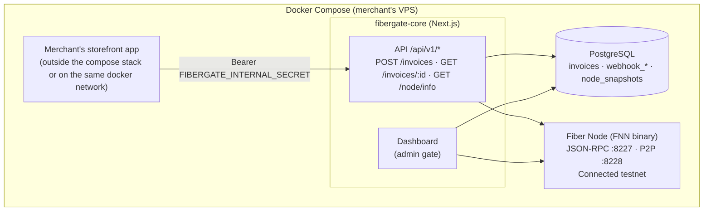
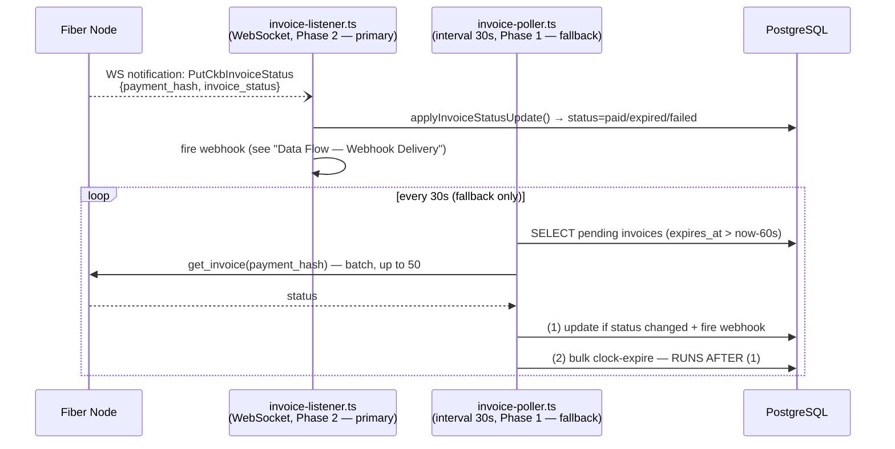
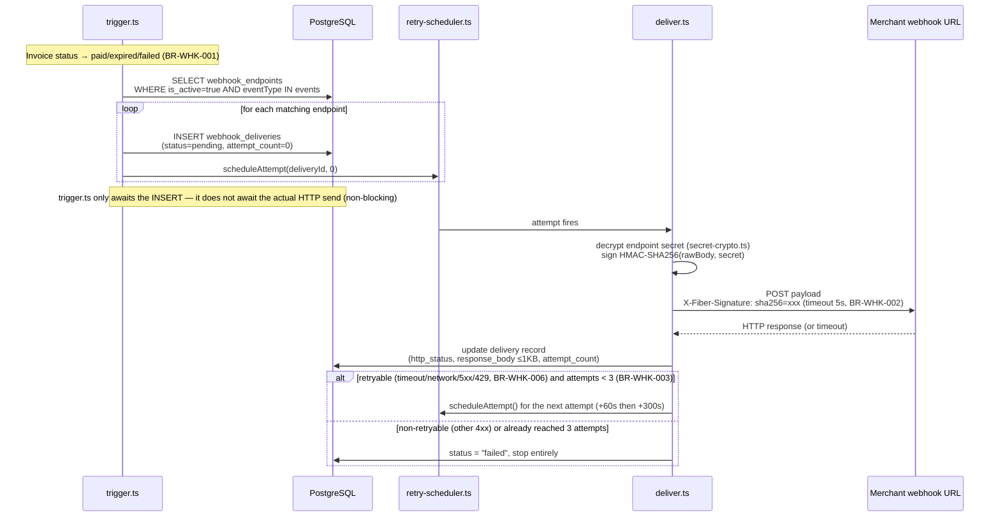

# System Design — FiberGate

> The diagram sections (Overview, Data Flow) have a public version (VitePress):
> `docs/architecture.md`. If you edit one of the two files, check the other one in
> the same edit (see `.context/INDEX.md`'s "Public docs mirror").

## Tech Stack

| Layer | Technology | Reason |
|-------|-----------|-------|
| Frontend + API | Next.js 14 App Router | Full-stack, runs as a single long-lived container (not serverless) |
| Database | PostgreSQL (separate container) + Drizzle ORM | Lightweight — no need for Auth/Realtime/Storage/Kong like a self-hosted Supabase — fits the goal of a compact docker-compose |
| Styling | Tailwind CSS + Antd | Fast, polished, ready-made components |
| SDK package | TypeScript + tsup | Zero-config bundler, ESM+CJS |
| Fiber Node | FNN binary | Its own container in the same docker-compose |
| Fiber client library | `@ckb-ccc/fiber` (official SDK) | Used in `lib/fiber/client.ts` to call RPC on fiber-node — "best starting point for app integrations" per the hackathon docs; `@fiber-pay/sdk` (community) is not used for the core flow |
| WebSocket client (Phase 2) | `ws` (dep of `apps/web`, issue #13) | `lib/fiber/subscribe-client.ts` — `@ckb-ccc/fiber` doesn't support subscriptions (see above); Node 20 (the base image pinned in `docker/fibergate-core/Dockerfile`) has no global `WebSocket` (only available from Node 22 onward), so a dedicated package was needed instead of hand-rolling RFC6455 or bumping the base image — settled directly with the human across 3 options |
| Hosting | Docker Compose | Merchants self-deploy on their own VPS (`docker compose up -d`) |
| Package manager | pnpm workspaces | Monorepo standard |
| Dev tooling | `dotenv-cli` (dep of `apps/web`) | `pnpm dev`'s script uses this to merge the root `.env` + `apps/web/.env.local`, avoiding duplicate secrets across the two files — see the Environment Variables section |
| Dev tooling | `vitest` (devDep of both `apps/web` and `packages/sdk`) | `apps/web`: unit tests at 2 layers — `lib/services/*.test.ts` mocks at the `@/lib/db` + `@/lib/fiber/client` boundary; `app/api/v1/**/route.test.ts` mocks at the `@/lib/services/*` boundary (`pnpm --filter web test:unit`). `packages/sdk`: `webhooks.test.ts` verifies HMAC edge cases, `client.test.ts` mocks the global `fetch` (`pnpm --filter sdk test:unit`) — the two package.json files declare their own version (both `^4.1.9`, deduped automatically via pnpm's content-addressable store), not hoisted to root |
| Dev tooling | `@usebruno/cli` (devDep of `apps/web`) | HTTP integration tests run via `bru run` against a real `/api/v1/*` — collection at root `bruno/` (`pnpm --filter web test:integration`) |

## Overall architecture



Every communication in the diagram above goes over the docker internal network — no
service publishes a public port except through `nginx` (see "TLS/WSS reverse proxy"
below).

**"Merchant's storefront app" made concrete (issue #12):** `apps/demo-storefront` is a
real implementation of this box — a workspace app fully separate from `apps/web` (no
shared code imports, no shared process/container), calling `POST /api/v1/invoices` via
`@fibergate/sdk` exactly like a real third-party merchant would, using
`FIBERGATE_BASE_URL` + `FIBERGATE_INTERNAL_SECRET` to point at `fibergate-core`.
Receives real webhooks at `POST /api/webhook` (verified with `@fibergate/sdk`'s
`verifyWebhookSignature()`), pushing updates to the browser via Server-Sent Events — no
polling. Deployed separately via the `apps/demo-storefront/docker-compose.demo.yml`
overlay (Dockerfile + compose overlay live right in the app's own directory, fully
self-contained — not part of the original 3-container merchant-facing bundle in
`docker-compose.yml`/`docker/`). See `docs/merchants/demo-storefront.md` for how to run
it locally.

## Data Flow — Creating an Invoice


After creation, an invoice's status is advanced by one of 2 parallel mechanisms (Phase 2
is primary, Phase 1 is a fallback — not disabled):



Running (1) before (2) in the Poller loop is **mandatory** (BR-STS-002(b)): bulk
clock-expire makes no RPC call, it only relies on the clock — running it first could
wrongly mark `expired` an invoice that was just paid right at its expiry moment (status
only moves in one direction, BR-STS-001, with no path back to `paid`). RPC batch
details: BR-POL-002/003. The listener was implemented + live-verified 2026-07-13 (issue
#13) — see "Phase 2 — Real-time Invoice Listener" right below.

## Phase 2 — Real-time Invoice Listener (verified against FNN source code, see `decisions-log.md`)

**Mechanism:** FNN ships an RPC module `pubsub`, method `subscribe_store_changes`
(unsubscribe via `unsubscribe_store_changes`, notification topic `store_changes`), using
a `jsonrpsee` WebSocket subscription — confirmed present from stable v0.8.1 onward, and
officially documented at `fiber.world/docs/api-reference#websocket-subscriptions`. The
node emits `StoreChange::PutCkbInvoiceStatus { payment_hash, invoice_status }` whenever
an invoice's status changes — exactly the event Phase 2 needs.

**2 gotchas found during live verification (2026-07-13, running real
`nervos/fiber:0.9.0-rc6`, see `decisions-log.md`) — not in the official docs, only
found by reading the real source + connecting for real:**
- **`pubsub` is NOT in FNN's default `rpc.enabled_modules`** (default confirmed via
  `crates/fiber-lib/src/rpc/config.rs` at tag `v0.9.0-rc6`:
  `cch,channel,graph,payment,info,invoice,peer`) — without this step,
  `subscribe_store_changes` doesn't exist on the node at all, it's not an auth error or
  anything else. `docker/fiber-node/config.yml`'s `rpc:` now has `enabled_modules:`
  listing the entire default list plus `pubsub` (setting this field in config.yml
  REPLACES the default entirely rather than appending to it, so it has to be listed out
  in full, not just `pubsub` on its own).
- **The returned subscription id is a JSON *number*, not a string** (e.g.
  `2883300409120665`) — every generic jsonrpsee subscription example online illustrates
  it as a string, which made the first version of `lib/fiber/subscribe-client.ts` (which
  only checked `typeof result === "string"`) never resolve against a real node, even
  though a unit test (with a made-up string response) still passed — caught by running a
  real live handshake via `docker run` + a `ws` script before considering issue #13 done,
  matching this project's "verify against real infra" ethos. Fixed by accepting both
  `string | number` for the subscription id.

**Constraints worth knowing before implementing:**
- The official docs state clearly: *"primarily intended for Cross-Chain Hub integration
  rather than general client use"* — this mechanism officially exists and is stable, but
  Nervos frames its intended purpose as CCH, not an invoice-webhook use case like
  FiberGate's. It works technically, but treat it as "off-label usage" — Phase 1's
  poller is still kept as a fallback (reduced to a 30-60s frequency) in case this
  mechanism's behavior changes between releases.
- The stream returns ALL `StoreChange` events (including `PutPreimage`,
  `PutPaymentSession`, `PutAttempt`), not filtered by payment_hash —
  fibergate-core must filter itself: only handle `PutCkbInvoiceStatus`, and only
  `payment_hash` values present in the internal `invoices` table.
- If Biscuit auth is enabled on the node (`FIBER_NODE_RPC_AUTH_TOKEN` set), the token
  needs the additional `read("cch")` permission to call `subscribe_store_changes`.
  `fnn` only requires Biscuit when `rpc.listening_addr` is an address it classifies as
  "public" (only loopback/private/link-local are considered "safe" — **`0.0.0.0` is NOT
  in this safe group even when only listening internally**, see the gotcha noted in
  `decisions-log.md` 2026-07-02). FiberGate avoids this requirement by binding
  `fiber-node` to a static private IP (`172.28.0.10`, see "fiber-node container" below)
  instead of `0.0.0.0` — the IP is within the RFC1918 range so `fnn` treats it as
  "private," Biscuit auth stays fully disabled, and the `read("cch")` requirement never
  comes up in the default setup.
- **`@ckb-ccc/fiber` (the official SDK used for other RPC calls) does NOT support
  subscriptions** (verified by pulling the real source from npm: `FiberClient` just
  wraps `ccc.RequestorJsonRpc`, pure request/response, with no line related to
  "subscribe"/"websocket"). → A small, dedicated WebSocket JSON-RPC client had to be
  written just to call `subscribe_store_changes`/receive `store_changes` notifications,
  running alongside `@ckb-ccc/fiber` for all other regular RPC calls in
  `lib/fiber/client.ts`.

## Data Flow — Webhook Delivery



Payload shape: `api/rest-api-spec.md`'s "Webhook Payload". The HMAC signing key is
always `webhook_endpoints.secret`, **unique per endpoint** (encrypted at rest with
`WEBHOOK_SECRET_ENCRYPTION_KEY`, see "Environment Variables"), not a single global
signing key — and retries follow a fixed schedule (`immediate → 1 minute → 5 minutes`,
BR-WHK-003), not exponential backoff.

## Monorepo Structure

```
fibergate/
├── apps/
│   └── web/                    ← Next.js app (fibergate-core)
│       ├── app/
│       │   ├── (dashboard)/    ← Protected routes (single-admin password gate)
│       │   │   ├── dashboard/
│       │   │   ├── webhooks/
│       │   │   └── transactions/
│       │   ├── api/
│       │   │   ├── v1/
│       │   │   │   ├── invoices/
│       │   │   │   └── node/
│       │   │   └── cron/       ← Optional: manual-trigger poll endpoint (not the primary source)
│       │   └── login/          ← Single-admin password gate
│       ├── lib/
│       │   ├── db/             ← Drizzle client + schema + helpers
│       │   └── fiber/          ← Fiber RPC client
│       └── components/
├── packages/
│   └── sdk/                    ← @fibergate/sdk
│       ├── src/
│       │   ├── index.ts
│       │   ├── client.ts
│       │   ├── types.ts
│       │   └── webhooks.ts
│       └── package.json
├── docker/                     ← Dockerfile for fibergate-core, fiber-node config
├── docker-compose.yml          ← Fiber node + PostgreSQL + fibergate-core
├── .context/                   ← Context files (this file)
├── .claude/
│   └── CLAUDE.md
├── pnpm-workspace.yaml
└── package.json
```

## Environment Variables

Full table of every variable (per `.env.example` file): see
`.context/architecture/env-vars.md` — this section only keeps the
architectural/current-state decisions that don't naturally fit into a single table.

There's no `DATABASE_URL` anywhere — `lib/db/` always builds the connection string
itself from 5 `POSTGRES_*` vars before initializing the Drizzle client, a single code
path shared by both Docker and local dev:

```ts
const databaseUrl = `postgres://${process.env.POSTGRES_USER}:${process.env.POSTGRES_PASSWORD}@${process.env.POSTGRES_HOST}:${process.env.POSTGRES_PORT}/${process.env.POSTGRES_DB}`
```

**Only 1 file holds real secrets** — the root `.env` (copied from `.env.example`),
shared by both `docker compose up -d` and `pnpm dev`. How it's generated: merchant path
→ `create-fibergate` (`docs/merchants/quickstart.md`); contributor/from-source path →
`pnpm generate:env` (`docs/maintainers/getting-started.md`'s "Generating a real
`.env`"). There's no automatic preflight checking the bcrypt/secret variables (postgres/
fibergate-core fail clearly on their own if missing) — `DOMAIN` alone has an
`nginx-certs-preflight` that generates a temporary self-signed cert if there's no real
cert yet.

`apps/web/.env.local` only overrides the 3 vars whose values differ from the root
`.env` when running `pnpm dev` outside Docker (`POSTGRES_HOST`, `POSTGRES_PORT`,
`FIBER_NODE_URL`) — `apps/web/package.json`'s `dev` script uses `dotenv-cli` to merge
the two files before spawning `next dev`: `dotenv -e .env.local -e ../../.env --
next dev` (the first-listed file wins). `POSTGRES_HOST=localhost` only works because
`docker-compose.yml`'s `postgres` service publishes the port loopback-only
(`127.0.0.1:5432`) — the same pattern used for `fiber-node`'s RPC (see the
"fiber-node container" section below).

`apps/demo-storefront` has a fully independent `.env.local` (`FIBERGATE_BASE_URL`,
`FIBERGATE_INTERNAL_SECRET`, `DEMO_WEBHOOK_SECRET`) — it doesn't read the root `.env`
or `apps/web`'s vars, even when deployed via the Docker Compose overlay
(`apps/demo-storefront/docker-compose.demo.yml` uses `env_file:` to read directly from
that file, only overriding `FIBERGATE_BASE_URL` via `environment:` to match the docker
DNS name).

History of related decisions/gotchas (the `FIBER_NODE_RPC_AUTH_TOKEN` var not yet
attached to real requests in the pinned SDK version; `DOMAIN`/`CERTBOT_EMAIL` becoming
required once nginx/certbot was added; splitting off a separate `.env` for
demo-storefront; Docker Compose not automatically forwarding `.env` into containers;
`env_file:` resolving its path relative to the project directory): see
`decisions-log.md` and `.context/processes/gotchas.md`.

## fiber-node container (docker-compose)

Deployment details settled while implementing issue #3 (see `decisions-log.md` for the reasoning):

- Image: the official `nervos/fiber` (Docker Hub) / `ghcr.io/nervosnetwork/fiber`
  (GHCR mirror), currently pinned to `nervos/fiber:0.9.0-rc6` — the image repo hasn't
  published any stable semver tag yet (only `0.9.0-rc1`..`rc6` prereleases +
  `sha-<hash>`), needs revisiting once a stable tag exists.
- The image automatically copies a bundled **testnet** config to `/fiber/config.yml`
  on first run if the file doesn't already exist (don't set `FIBER_CONFIG_TEMPLATE` —
  that variable switches to the mainnet config). FiberGate pre-seeds
  `docker/fiber-node/config.yml` instead of letting the image auto-generate it, so the
  repo state is correct from the start.
- **Important gotcha**: the RPC listener in the bundled config binds to
  `127.0.0.1:8227` by default (loopback-only inside the container) —
  `fibergate-core` (a different container) can't reach it there. **DO NOT change it to
  `0.0.0.0:8227`** — it seems reasonable, but `fnn` (the pinned `0.9.0-rc6` build)
  classifies `0.0.0.0` as a "public" address (only loopback/private/link-local are
  considered "safe") and **refuses to start** without `rpc.biscuit_public_key` set
  (error: `Cannot listen on a public address without a biscuit public key set in the
  config`) — discovered the first time it was run live for real, see the full account
  in `decisions-log.md` 2026-07-02. The correct approach: assign `fiber-node` a
  **static private IP** on the `fibergate-net` network (`docker-compose.yml`'s
  `networks.fibergate-net.ipam.config.subnet: 172.28.0.0/24` +
  `fiber-node.networks.fibergate-net.ipv4_address: 172.28.0.10`), then set
  `rpc.listening_addr: 172.28.0.10:8227` — the IP is in the RFC1918 range so `fnn`
  treats it as "private," passing the check without needing Biscuit, while still only
  being reachable within the internal docker network as before. Knock-on effect: the
  `fnn-cli info` healthcheck (run inside the container itself, which defaults to
  `127.0.0.1`) had to change to `fnn-cli -u http://172.28.0.10:8227 info` since
  loopback no longer reaches the RPC.
- The node needs `FIBER_SECRET_KEY_PASSWORD` (env) + a CKB private key file mounted at
  `<data-dir>/ckb/key` (data dir mounted at container path `/fiber`) — this is the
  merchant's own CKB signing secret, self-supplied. `FIBER_SECRET_KEY_PASSWORD`
  **isn't** one of the 8 app-level vars in `.env.example` above (only `fiber-node`
  reads it, not `fibergate-core`'s code), but it's still present in `.env.example` —
  in its own section, separate from the 8 app vars — so a merchant doesn't miss it
  when just following a single `cp .env.example .env` step. This UX decision changed
  from the original design (deliberately excluding it from `.env.example`
  entirely), see `decisions-log.md`.
- The image ships with `fnn-cli`, usable for the healthcheck (`fnn-cli info`) without
  needing to install curl/wget.
- RPC is published to the host as **loopback-only**: `ports: "127.0.0.1:8227:8227"`
  in `docker-compose.yml`. Reason: `pnpm dev` (running `apps/web` directly on the
  host, not through Docker) needs to reach `fiber-node` without editing `/etc/hosts`
  or adding a `docker-compose.override.yml`. Very different from a plain
  `"8227:8227"` (defaults to binding `0.0.0.0`, which would expose RPC without auth
  enabled to the internet if the host has a public IP) — `127.0.0.1:8227:8227` is
  never exposed beyond the machine it's running on, whether that machine is a laptop
  or a VPS with a public IP, so it still satisfies issue #3's requirement that
  "fiber-node does NOT bind a public IP/port." Verified: `docker compose ps` shows
  exactly `127.0.0.1:8227->8227/tcp`, and `ss -tlnp` confirms the socket only LISTENs
  on `127.0.0.1`.

## Dashboard auth: session cookie + middleware guard (issue #9)

`apps/web/middleware.ts` guards every route under `app/(dashboard)/**` with a session
cookie JWT (signed via `jose`, secret `DASHBOARD_SESSION_SECRET`, see
`apps/web/lib/auth/session.ts`). Login/logout is a Next.js Server Action
(`app/login/actions.ts`), not an `/api/*` route — it doesn't go through the
`{data,error}` envelope (that envelope only applies to `/api/v1/*`, see
`api/rest-api-spec.md`).

- **Important gotcha — `middleware.ts`'s `config.matcher` must be a literal, it
  cannot be imported from another file**: Next.js statically extracts `config` at
  build time with a limited AST parser that can only resolve literal values declared
  right there, not an identifier imported from another module. The matcher was
  initially split out into `lib/auth/routes.ts` (`PROTECTED_PATH_MATCHERS`) to keep
  things tidy — verifying with a real `next build` surfaced the warning `"Next.js
  can't recognize the exported 'config' field... The default config will be used
  instead"` — meaning the guard was completely disabled, with middleware running on
  **every** route instead of just the 3 intended ones. Consequence if undetected:
  `/login` would guard itself → infinite redirect loop; every `/api/v1/*`/`/api/cron/*`
  request (auth via Bearer header, not a session cookie) would be wrongly blocked and
  redirected to `/login`. Fix: the matcher array is now inlined directly in
  `middleware.ts`'s `config` export; `lib/auth/routes.ts` now only keeps
  `ROUTE.LOGIN`/`ROUTE.DASHBOARD` (used at runtime inside a function body, not static
  config, so a normal import is fine there). The `(dashboard)` route group doesn't
  appear in the URL, so the matcher is a manually maintained allowlist listing each
  existing subroute (`/dashboard`, `/webhooks`, `/transactions`) — adding a new page
  under `(dashboard)/` requires manually adding its path pattern to this matcher; it
  isn't guarded automatically.
- **The cookie's `Secure` flag is based on the `X-Forwarded-Proto` header, not on
  `NODE_ENV`**: `docker/fibergate-core/Dockerfile` hardcodes `NODE_ENV=production`,
  but `fibergate-core` itself doesn't do TLS termination —
  `apps/web/lib/auth/session.ts`'s `isHttpsRequest()` reads the `X-Forwarded-Proto`
  header instead of checking `NODE_ENV==="production"`; without that header,
  `secure: false`. **Updated 2026-07-09 (issue #17)**: there's now real TLS
  termination — `nginx` (a new service in `docker-compose.yml`, see "TLS/WSS reverse
  proxy (nginx + certbot)" right below) correctly sets `X-Forwarded-Proto: https` when
  forwarding to `fibergate-core:3000`, so `secure: true` is now real behavior on the
  default deploy, no longer just "if a proxy gets added later." Along with this:
  `fibergate-core`'s port publish changed from `"3000:3000"` to
  `"127.0.0.1:3000:3000"` (loopback-only, as anticipated earlier) — no longer
  published directly to the host; `nginx` is now the sole public entry point,
  preventing someone from calling `http://host:3000` directly, bypassing nginx to
  fake the header and fool the cookie.

### Admin password: DB-backed with env-var seed (issue #30)

Login itself (`app/login/actions.ts`'s `login()`) doesn't change behavior — it still
`bcrypt.compare`s the entered password against a single hash. What changes is
**where that hash comes from**: `getAdminPasswordHash()`
(`lib/services/settings.ts`) reads the `settings` table (key `admin_password_hash`)
first; if no row exists yet (a fresh deployment, or the password was never changed via
the Dashboard) → falls back to reading `ADMIN_PASSWORD_HASH_B64`, identical to the old
logic (base64 decode). In other words, the env var now only **seeds the initial
value** — as soon as the admin changes the password for the first time via
`/settings` (`setAdminPassword()`, bcrypt cost 10 — the same cost factor
`create-fibergate` uses internally via `bcryptjs` at scaffold time), a row is upserted
into `settings` and **from then on the DB always wins**; the env var is never read
again for that deployment (there's no mechanism to delete the row to "go back" to
reading the env var — if a reset is ever needed, it requires a manual
`DELETE FROM settings WHERE key = 'admin_password_hash'` via psql).

`/settings` (a new route, `app/(dashboard)/settings/`) sits behind the same
session-cookie guard as every other `(dashboard)` route (`middleware.ts`'s
`config.matcher`, with `/settings/:path*` added) — changing the password requires an
already-valid session (already logged in), and the `changePassword()` Server Action
(`app/(dashboard)/settings/actions.ts`) requires re-entering the correct current
password before allowing the change (compared via `getAdminPasswordHash()` +
`bcrypt.compare`), preventing a hijacked session (a tab left logged in, an unlocked
machine) from changing the password without the real admin knowing.

### TLS/WSS reverse proxy (nginx + certbot) — issue #17

`docker-compose.yml` gained 3 new services: `nginx-certs-preflight` (one-shot,
generates a temporary self-signed cert if there's no real cert yet, so `nginx` can
start the first time — the same spirit as `fiber-node-preflight`), `nginx` (the
official `nginx:1.27-alpine` image, **no custom build needed** — verified that
`nginx -V` already has `--with-stream`/`--with-stream_ssl_module`/
`--with-stream_ssl_preread_module` compiled in statically), and `certbot` (a renew
loop only — first issuance moved to a dedicated service, see next paragraph).
`nginx` is the ONLY service that publishes a real public host port (`80`, `443`,
`8228`) — `postgres`/`fiber-node`/`fibergate-core` all remain loopback-only.

A 4th service, `certbot-init` (`profiles: ["manual"]`, never starts via a plain
`docker compose up -d`), was added later (decisions-log.md 2026-07-15) to fix a
self-inflicted bug: the docs originally told merchants to get their first cert via
`docker compose run --rm certbot certonly ...`, but `docker compose run <service>
<args>` only overrides CMD, never a Compose-file `entrypoint:` override — and
`certbot`'s own `entrypoint: sh -c "...while :; do certbot renew ...; done"`
(needed so it loops forever as a background daemon) silently swallowed any args
passed this way, spinning up a second infinite loop instead of running `certonly`.
Confirmed via `docker inspect certbot/certbot:latest` that the upstream image's own
native `ENTRYPOINT` is `["certbot"]` (`CMD null`) — designed for exactly this
one-off invocation style. `${DOMAIN}`/`${CERTBOT_EMAIL}` are baked in from `.env`
via Compose's own interpolation, so merchants just run `docker compose run --rm
certbot-init` with zero placeholders. Shares the same `certbot-conf`/`certbot-www`
volumes as `certbot` — purely additive, no change to the existing renew-loop
service's behavior.

`certbot-init` DOES now override `entrypoint:` (to `sh -c "<script>"`, unlike a bare
`certonly` invocation) — added after a second real-deploy failure
(decisions-log.md 2026-07-15): `nginx-certs-preflight`'s temporary self-signed cert
is written straight to `/etc/letsencrypt/live/${DOMAIN}/*.pem`, the same path
certbot itself uses for a real lineage, but with no matching
`renewal/${DOMAIN}.conf`. certbot's own `new_lineage()` safety check
(`storage.py`) refuses to overwrite a `live/` directory it doesn't recognize —
so the very first `certbot-init` run against a real domain would successfully
register the account and validate the ACME challenge, then abort at the last
step with `live directory exists for <domain>`. The `entrypoint:` script now
`rm -rf`s `live/${DOMAIN}`/`archive/${DOMAIN}`/`renewal/${DOMAIN}.conf` first,
but ONLY when the lineage isn't already complete — i.e. either
`renewal/${DOMAIN}.conf` OR `live/${DOMAIN}/cert.pem` is missing — so re-running
`certbot-init` after a real cert is already issued never touches it. The check
requires both conditions rather than just the renewal config's existence
because a *failed* `certonly` run can itself leave behind an orphaned
`renewal/${DOMAIN}.conf` (certbot creates that file before the checks that can
abort the run — see `decisions-log.md` 2026-07-15) which would otherwise make
the next attempt think the domain name is taken and silently save under a
`-0001`-suffixed name that nginx never looks for.

`nginx.conf.template`'s architecture (`docker/nginx/`, templated with
`envsubst '$DOMAIN'` at container start — exactly one variable, to avoid envsubst
mistakenly consuming nginx's own runtime `$variables`, the same class of bug as the
Docker Compose `$`-escaping gotcha noted in `decisions-log.md` 2026-07-02):
- `:80` — ACME HTTP-01 challenge (webroot) + redirect to https.
- `:443 ssl` — dashboard/API, `proxy_pass` to `fibergate-core:3000`, setting
  `X-Forwarded-Proto: https`.
- `127.0.0.1:8443 ssl` (internal-only, not published to the host) — terminates TLS,
  proxies the WebSocket upgrade to `fiber-node:8228` (the plain P2P port inside the
  container, unchanged).
- A `stream{}` block on `:8228` (public) — uses `ssl_preread` to distinguish: a TLS
  ClientHello (WSS, from a browser wallet) → forwarded to `127.0.0.1:8443` above; not
  TLS (raw TCP, a regular P2P node) → forwarded straight to `fiber-node:8228`. This
  technique is copied directly from the official `nervosnetwork/fiber` docs'
  `docs/fiber-node-wss.md` (pinned to the exact tag `v0.9.0-rc6`, matching the
  `nervos/fiber:0.9.0-rc6` image in use), only changing the port numbers to match this
  project's Docker networking (the original doc shares a single port `443` for both
  purposes; this project splits `:443` for the dashboard and `:8228` for P2P/WSS since
  it needs a clean `:443` for the dashboard).

`fiber-node`'s P2P listener (`fiber.listening_addr: "/ip4/0.0.0.0/tcp/8228"` in
`docker/fiber-node/config.yml`) is unchanged — it already binds `0.0.0.0` inside that
container's own private network namespace; `nginx` reaches it over the internal Docker
network (`fiber-node:8228`), with no host port published directly for this port
(unlike RPC's `172.28.0.10:8227` — the P2P port isn't governed by fnn's "public
address refusal" check, only RPC is). `announced_addrs` is the one place that needs a
manual edit (this file is read directly by `fiber-node`, not through Docker Compose
interpolation) to add `/dns4/<DOMAIN>/tcp/8228/wss` — see the comment in that file
itself.

**Decided scope**: `nginx` only fronts `fibergate-core` (dashboard/API +
`fiber-node`'s P2P/WSS), it does NOT front `apps/demo-storefront` (a fully separate
app with its own compose overlay) — staying within issue #17's original scope.
Nginx+certbot were also folded directly into the root `docker-compose.yml` (not an
optional overlay) — meaning **every** `docker compose up -d` from now on needs
`DOMAIN`/`CERTBOT_EMAIL` in `.env` and ports 80/443/8228 open to the internet for it
to actually be usable over HTTPS (though the container still starts fine with a
temporary self-signed cert if those are missing). This is a change from the previously
implicit model of "every merchant just needs `docker compose up -d`, no domain
required" — see `decisions-log.md` 2026-07-09 for why the human chose this direction.
- **`ADMIN_PASSWORD_HASH_B64` stores base64, not the raw bcrypt hash — 2 different
  `.env`-loading mechanisms corrupt the `$` character in 2 different ways, with no
  escaping scheme that satisfies both** (discovered while the human manually tested
  `pnpm dev` login after PR #32 merged, see `decisions-log.md` 2026-07-05 for the full
  investigation): the root `.env` is shared by both `docker compose up -d` (Docker
  Compose auto-interpolates `$VAR`/`${VAR}` inside `.env` values, treating `$$` as an
  escape for a literal `$`) and `pnpm dev`/`build`/`db:generate`/`db:migrate` (via
  `dotenv-cli`, using `dotenv-expand` internally — which also auto-interpolates `$VAR`
  but with a different algorithm that does NOT treat `$$` as an escape for a literal
  `$`). Verified against real containers (`docker compose run --rm test printenv
  TESTVAR`, not just trusting `docker compose config`'s output — that command
  re-escapes `$` when displaying it, so it can look correct even when the real
  runtime value is wrong) and with `npx dotenv-cli -- node -e "console.log(...)"`:
  there's no way to write `$`/`$$`/`\$` in `.env` that produces the correct value in
  **both** mechanisms at once — the correct escaping for one side is always wrong on
  the other. Also tried `dotenv-cli`'s `--no-expand` flag and Docker Compose's
  `env_file:` directive (instead of the current `environment: ${VAR}`) — neither
  solved it, since Docker Compose still auto-interpolates values read from
  `env_file:` exactly the same way it does for the root `.env`. Fix:
  `ADMIN_PASSWORD_HASH_B64` stores the base64 of the original hash (the base64
  alphabet has no `$` character), and `app/login/actions.ts` decodes it back with
  `Buffer.from(value, "base64").toString("utf-8")` before `bcrypt.compare()` — both
  `.env`-loading mechanisms pass base64 through unchanged, no escaping needed at all.
  Known trade-off: this is a stopgap fix for the current env-var-only model —
  if/when issue #30 (moving `ADMIN_PASSWORD_HASH` to be DB-backed) is implemented,
  this problem disappears entirely for day-to-day verification (Postgres/Drizzle
  don't care about `$` characters), leaving only a single seed-time step that needs
  its own design (this env-var mechanism shouldn't be reused as-is for that seed
  step).

  > **Updated 2026-07-11**: issue #30 was implemented exactly as anticipated above —
  > see "Admin password: DB-backed with env-var seed" above.

## Published image + release compose (issues #21, #41)

`fibergate-core` now has 2 parallel build/deploy paths, neither replacing the other:

- **`docker-compose.yml` (root)**: builds from source (`build:` block), for
  contributors/dev — requires cloning the monorepo.
- **`docker-compose.release.yml` (new)**: `fibergate-core` uses
  `image: ghcr.io/${GHCR_NAMESPACE}/fibergate-core:${FIBERGATE_CORE_TAG:-latest}`
  instead of `build:` — a merchant only needs this file + `docker/fiber-node/config.yml`
  + `docker/nginx/nginx.conf.template` + `.env` (from `.env.release.example`), no need
  to clone the repo. Same 6 services as the original (minus `fiber-node-payer`,
  dev-only) — see `docs/merchants/quickstart.md` (CLI) / `docs/merchants/deployment.md`
  (manual).

**Registry: GHCR (`ghcr.io`), not Docker Hub** — differs from the original suggestion
in issue #41's body, changed via a direct decision with the human during
implementation (see `decisions-log.md` 2026-07-11): no third-party account needed,
`GITHUB_TOKEN` is already available in GitHub Actions and works out of the box, no
secret needed to be created manually.

**Tagging: git commit SHA** (`sha-<short-sha>`, per issue #21's "reproducible deploys"
— a merchant can pin `FIBERGATE_CORE_TAG` to a specific build instead of always
tracking `latest`), plus a floating `latest` tag tracking `canary`'s HEAD.
Build + push happens automatically via `.github/workflows/docker-publish.yml` —
triggered by `push` to `canary` + `workflow_dispatch` (for manual testing before
trusting the automatic trigger). No semver — there's no version-bump/changelog
process to go with it at the current hackathon scope, SHA is enough to trace back to
the exact commit.

> **Updated 2026-07-12**: the first real CI run failed twice in a row, both times a
> gotcha around building the Docker image in CI (quite different from a local build,
> which always has the runner's own `.env`/`apps/web/.env.local` on hand) — both were
> fixed, full details + verification steps in `decisions-log.md` 2026-07-12.
> **Live-verified**: `gh run list --workflow=docker-publish.yml` confirms the 2 most
> recent runs on `canary` both `success`; the human manually ran
> `docker compose -f docker-compose.release.yml up -d` with the real image
> successfully pulled from GHCR and running (issue #48 testing) — a real package
> visibility gotcha was hit: making the GitHub repo public does **not** automatically
> change the GHCR package's visibility along with it; you have to go into the repo →
> Packages → `fibergate-core` → Package settings → Public separately.
>
> **The create-fibergate CLI (issue #48)** is now the recommended way to get these 4
> files (`docker-compose.release.yml`, `docker/fiber-node/config.yml`,
> `docker/nginx/nginx.conf.template`, `.env.release.example` → `.env`) instead of
> manually `curl`-ing each file — see `packages/create-fibergate/`,
> `docs/merchants/quickstart.md`. `docs/merchants/deployment.md` keeps the manual
> path (hand-editing the files the CLI generates, or running the CLI on another
> machine and `scp`-ing it to a host with no Node.js) — there's no longer a
> standalone curl-3-files flow that skips the CLI.
>
> **Auto-migrate on `fibergate-core` startup** (a follow-up within the same issue
> #48): `docker/fibergate-core/Dockerfile`'s `CMD` now runs
> `apps/web/scripts/migrate.mjs` (drizzle-orm's programmatic migrator, not the
> `drizzle-kit` CLI — lighter, doesn't pull in the devDependency toolchain) before
> starting the server — a merchant no longer needs to manually run
> `pnpm --filter web db:migrate` for either Docker deploy path, including future
> version updates (idempotent via the `__drizzle_migrations` table). Full details +
> verification steps: `decisions-log.md` 2026-07-12.
>
> **Updated 2026-07-13**: found via real testing — the human re-ran
> `docker compose -f docker-compose.release.yml up -d` after a new `:latest` image
> had been published, but the auto-migrate above **did not run** because Docker
> doesn't automatically re-pull `:latest` if that tag already exists locally
> (Docker's default behavior — `:latest` is just a tag name, not an instruction to
> "always fetch the newest version"). Fix: added `pull_policy: always` to
> `fibergate-core` in `docker-compose.release.yml` (only this file —
> `docker-compose.yml` uses `build:` from source, not affected) — forcing every
> `docker compose up -d` to check GHCR before starting, verified directly (`docker
> compose up` logs "Pulling"/"Pulled" even when the image already exists locally).
> Trade-off: every `up -d` (even a plain restart) now needs network access to GHCR —
> acceptable, since a "latest" tag should actually always be the latest.
>
> **Known, unresolved gotcha** (issue #49): `fibergate-net`'s subnet
> `172.28.0.0/24` is hardcoded identically in both `docker-compose.yml` and
> `docker-compose.release.yml` (necessary because `fiber-node` must have the static
> IP `172.28.0.10` — `fnn` refuses to bind `0.0.0.0` without Biscuit auth
> configured) — running 2 FiberGate stacks at once on the same machine (e.g. a dev
> stack + a scaffolded test deploy) gets rejected by Docker when creating the second
> network, with a "Pool overlaps" error.
