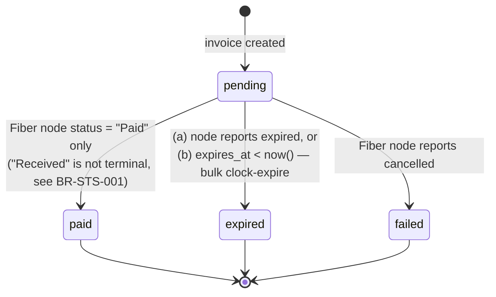

# Business Rules — Payment Processing

## Invoice Rules

**BR-INV-001:** Minimum amount: 0.1 CKB (= 10,000,000 shannon). Maximum amount: 1,000 CKB for the prototype.

**BR-INV-002:** Asset only accepts "CKB" or "RUSD" in the prototype.

> **Updated 2026-07-03 (issue #5)**: `lib/fiber/client.ts`'s `createInvoice()` currently
> **only implements "CKB"** — `@ckb-ccc/fiber`'s `Currency` enum only has the native
> denominations (`Fibb`/`Fibt`/`Fibd`), no value for RUSD (a UDT). Passing
> `asset: "RUSD"` throws a clear `UnsupportedAssetError`, no silent failure. RUSD/UDT
> support was split into its own issue — see **issue #27** (Phase 1 — Core milestone,
> depends on #5). This rule ("CKB or RUSD") is still correct as long-term business
> intent, it just wasn't fully implemented yet at the time.
>
> **Updated 2026-07-09 (issue #27)**: "RUSD" is now fully implemented. Reading
> `@ckb-ccc/fiber`'s source more closely (`src/types/invoice.ts`) revealed: a UDT
> invoice **isn't a separate code path** — it uses the same RPC `new_invoice`/method
> `sdk.newInvoice()` as CKB, just with one extra optional field `udtTypeScript`
> (`currency` is always still `Fibt`; that field only encodes the network, not the
> asset). `lib/fiber/client.ts`'s `resolveUdtTypeScript()` fetches RUSD's type script
> from the node itself (RPC `node_info`'s `udtCfgInfos`, which mirrors
> `docker/fiber-node/config.yml`'s `ckb.udt_whitelist` — already pre-configured with
> the real RUSD on testnet), caching it in-memory for the process lifetime (the
> whitelist is static config that only changes on a node restart with a new
> config.yml — that restart also restarts `fibergate-core` via the docker-compose
> dependency, so the cache never actually goes stale in practice). If the node doesn't
> have RUSD in its whitelist → throws `UdtNotConfiguredError` (distinct from
> `UnsupportedAssetError` — a node configuration error, not an asset FiberGate doesn't
> support). No database schema or `lib/api/validation.ts` changes in this issue —
> `amount_shannon`/`SHANNON_PER_CKB`/BR-INV-001's "0.1–1000 CKB" still apply unchanged
> to RUSD even though the naming/limits use purely CKB-flavored language (a known,
> accepted trade-off for the hackathon prototype). Generalizing amount/schema to be
> properly multi-asset is tracked in a separate follow-up issue.

**BR-INV-003:** Default expiry time: 3600 seconds (1 hour). Maximum 86400 seconds (24 hours).

**BR-INV-004:** Amount conversion: `shannon = Math.round(amount_ckb * 100_000_000)`. Stored as bigint in the DB.

**BR-INV-005:** invoice_address and payment_hash come from the Fiber node RPC `new_invoice`. Never self-generated.

## Status Transition Rules

> This state diagram has a public version (VitePress): `docs/architecture.md`'s "Invoice
> status lifecycle". If you edit one of the two files, check the other one in the same
> edit (see `.context/INDEX.md`'s "Public docs mirror").

**BR-STS-001:** Status only moves in one direction: `pending → paid | expired | failed`. Cannot be reversed.

> **Updated 2026-07-04 (issue #7, background poller)**: The node-status → `paid` mapping
> is now settled. `@ckb-ccc/fiber`'s `CkbInvoiceStatus` has 5 values (`"Open" |
> "Cancelled" | "Expired" | "Received" | "Paid"`), but this rule previously never
> specified which value maps to `invoices.status = 'paid'`. Now settled: **only
> `"Paid"` maps to `paid`** — confirmed via Fiber's Rust source
> (`crates/fiber-types/src/invoice.rs`'s doc comment "the invoice is received, but not
> settled yet" for `Received`; `crates/fiber-lib/src/fiber/channel.rs:1898` only sets
> `CkbInvoiceStatus::Paid` when a TLC is removed with `RemoveTlcFulfill`, i.e. full
> settlement at the channel layer). `"Received"` **is not** a terminal state — the
> invoice stays `pending`, its status unchanged for that cycle;
> `lib/fiber/client.ts`'s `createInvoice()` already supplies the preimage to the node
> at invoice creation time (not a hold-invoice flow), so `Received → Paid` happens
> automatically, near-instantly on the node side — the poller will observe `"Paid"` on
> the next 10s cycle without any further action needed. Implemented in
> `apps/web/lib/poller/invoice-poller.ts`'s `applyNodeStatus()`. See
> `.context/processes/decisions-log.md` [2026-07-04] for the corresponding entry.

**BR-STS-002:** Status "expired" is set when: (a) the Fiber node reports expired, or (b) `expires_at < now()` even without a poll.

> **Updated 2026-07-05 (bug fix found via code review, issue #7)**: (b) — bulk
> clock-expire — **must run AFTER** the RPC poll step (a) in the same cycle, not
> before. The original bug: `runPollCycle()` ran the clock-based expire step first,
> so an invoice paid right at/just after its expiry moment (`expires_at < now()` at
> the time the cycle ran, but the Fiber node had already recorded `"Paid"`) would be
> marked `expired` before the RPC step got a chance to see it — and because
> BR-STS-001 only moves in one direction, this invoice would be stuck at `expired`
> forever even though the customer really paid, and the merchant would never receive
> `payment.paid`. Fixed by reordering `apps/web/lib/poller/invoice-poller.ts`'s
> `runPollCycle()`: the RPC poll batch (a) runs first, bulk clock-expire (b) runs
> after — see the full flow detail in `architecture/system-design.md`'s "Data Flow —
> Creating an Invoice" step 3.

**BR-STS-003:** Status "failed" is set when: the Fiber node reports the invoice as cancelled.

## Polling Rules

**BR-POL-001:** Phase 1: an in-process interval worker running inside the `fibergate-core` container every 10 seconds (no longer Vercel Cron — self-hosted runs a long-lived container, not serverless). `/api/cron/poll-invoices` is kept as an optional endpoint to trigger a manual poll. **Phase 2 (issue #13, implemented + live-verified 2026-07-13)**: added a WebSocket subscription `subscribe_store_changes` (FNN's `pubsub` RPC module, available since stable v0.8.1) as the primary path for detecting payments — see design details + 2 gotchas found during live verification in `architecture/system-design.md`. The interval poll (`lib/poller/worker.ts`) had its frequency reduced to **30s** as a fallback — kept in place rather than removed entirely, since the official docs state this mechanism is "primarily intended for Cross-Chain Hub integration rather than general client use".

**BR-POL-005:** The `store_changes` subscription client must filter: only handle the `PutCkbInvoiceStatus` variant, and only `payment_hash` values that exist in the internal `invoices` table — ignore every other variant/payment_hash in the stream. Implemented in `apps/web/lib/poller/invoice-listener.ts` (variant filter), which calls into `apps/web/lib/poller/invoice-poller.ts`'s `applyInvoiceStatusUpdate()` (payment_hash lookup filter, sharing `applyNodeStatus()`/`TERMINAL_TRANSITIONS` with the RPC-driven batch poller — a single place decides which node statuses are terminal).

**BR-POL-002:** Only poll invoices with `status = "pending"` and `expires_at > now() - 60s`.

**BR-POL-003:** Each poll batch is capped at 50 invoices to avoid blocking the event loop for too long in the long-lived container.

**BR-POL-004:** If the Fiber node doesn't respond within 5s, skip and log an error, don't change status.

## Webhook Rules

**BR-WHK-001:** Fire a webhook as soon as an invoice status changes to a terminal state (paid/expired/failed).

**BR-WHK-002:** Webhook request timeout: 5 seconds.

**BR-WHK-003:** Retry strategy: immediate → 1 minute → 5 minutes. Maximum 3 attempts total.

**BR-WHK-004:** Webhook payload must be signed with HMAC-SHA256, keyed with the webhook endpoint's secret.

**BR-WHK-005:** Store the full delivery history in `webhook_deliveries` whether it succeeds or fails.

**BR-WHK-006:** Classify each delivery attempt as retryable / non-retryable (added 2026-07-06,
issue #8, implemented in `apps/web/lib/webhooks/deliver.ts`):
- **Retryable** (schedules the next attempt per BR-WHK-003's schedule, up to 3 attempts total): request
  timeout (BR-WHK-002, no response within 5s), network-layer errors (DNS/connection refused/reset),
  HTTP 5xx (500-599), HTTP 429.
- **Non-retryable** (records the attempt with `status='failed'`, does NOT schedule a further attempt,
  `attempt_count` stays at its current value): any other 4xx code (400, 401, 403, 404, 405,
  410, 422, ...) — signals a merchant-side configuration/logic error that retrying within a few
  minutes can't self-heal.
- BR-WHK-005 (record every attempt regardless of outcome) still applies unconditionally — this rule
  only affects whether a further attempt gets scheduled, not whether the current attempt gets recorded.

## Rate Limiting Rules

**BR-RTE-001:** The whole deployment is capped at 100 invoices/minute (prototype, single-tenant — still kept as an anti-abuse guard).

**BR-RTE-002:** GET /invoices list is capped at 100 items/request.

## Security Rules

**BR-SEC-001:** `FIBERGATE_INTERNAL_SECRET` is only set via an env var at deploy time, compared in constant time (not a plain `===`), never logged to the console or returned in a response.

**BR-SEC-002:** `ADMIN_PASSWORD` (dashboard single-admin login) must be hashed with bcrypt before storing/comparing, never stored as plaintext.

> **Updated 2026-07-05 (issue #9, found while the human manually tested `pnpm dev` login)**: The env var
> was renamed to `ADMIN_PASSWORD_HASH_B64`, storing **the base64 of the bcrypt hash**, not the raw
> `$2y$10$...` string. Reason: the raw hash contains `$` characters, and the two `.env` loading
> mechanisms (Docker Compose vs `dotenv-expand`, used by `pnpm dev`) corrupt this character in
> two different ways — there's no escaping scheme correct for both at once (verified against real
> containers). Base64 has no `$` character, so it avoids the whole problem. `app/login/actions.ts`
> decodes it back before `bcrypt.compare()`. Full details: see `decisions-log.md` 2026-07-05 and
> `system-design.md`'s "Dashboard auth: session cookie + middleware guard".

> **Updated 2026-07-11 (issue #30)**: The hash is now **DB-backed** — the `settings` table
> (`lib/services/settings.ts`), key `admin_password_hash`. Read order: a row exists in
> `settings` → use that row; none exists yet (password never changed via Dashboard → Settings) →
> fall back to reading `ADMIN_PASSWORD_HASH_B64`, identical to the old logic. Changing the password
> via the Dashboard requires re-entering the current password first (verified via `bcrypt.compare`),
> and the new password must be at least 8 characters (an assumption — no BR sets a more complex
> rule, can be changed if needed). Once a row exists in the DB, the env var is never read again for
> that instance. Still never stores plaintext — only the *storage location* of the bcrypt hash
> changed, not how it's hashed.

**BR-SEC-003:** The webhook secret must be random, at least 32 bytes.

**BR-SEC-004:** The dashboard session uses an httpOnly cookie signed with its own secret (not `FIBERGATE_INTERNAL_SECRET`).

> **Updated 2026-07-05 (issue #9, implemented in `apps/web/lib/auth/session.ts`)**: The cookie's
> `Secure` attribute is based on the actual request's `X-Forwarded-Proto` header (set by the reverse
> proxy's TLS termination), not on `NODE_ENV` — the default docker-compose bundle has no TLS
> termination at all, so gating `Secure` on `NODE_ENV==="production"` would make the browser
> silently refuse to store the cookie on the very default deploy flow (plain HTTP) — login would
> look successful but the session wouldn't persist. See details + constraints for adding a TLS
> reverse proxy later in `architecture/system-design.md`'s "Dashboard auth: session cookie +
> middleware guard".