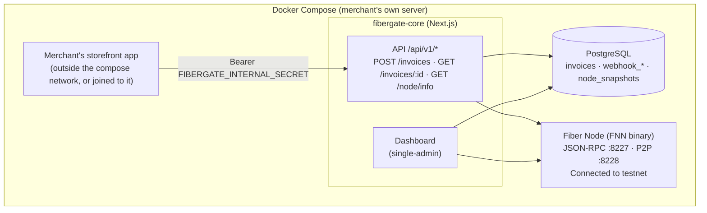
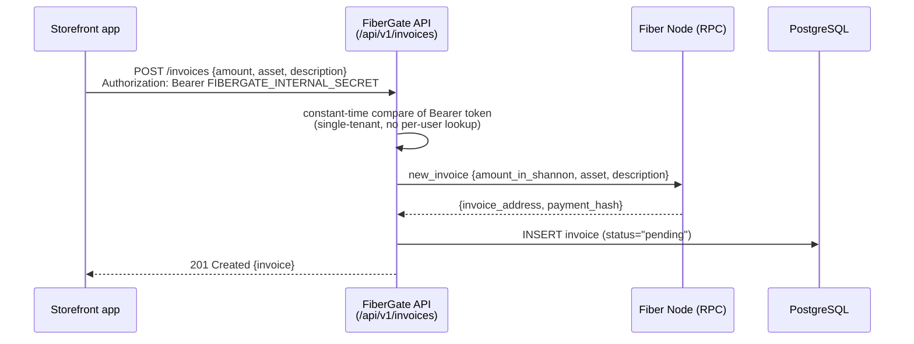
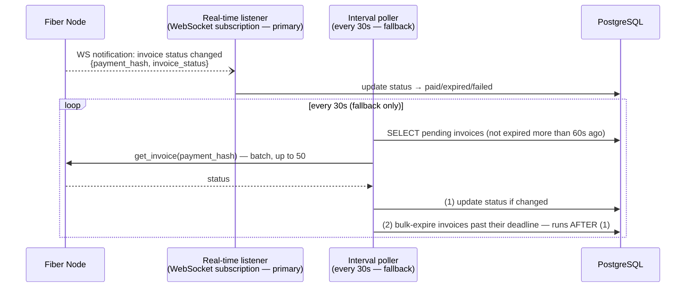
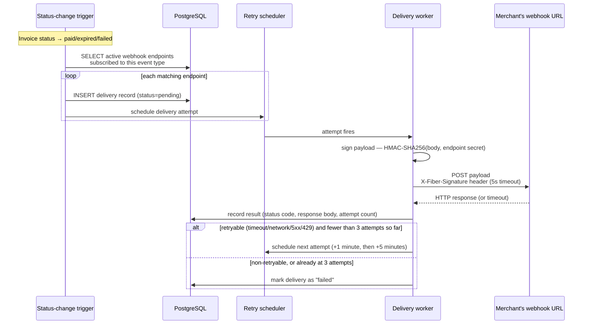
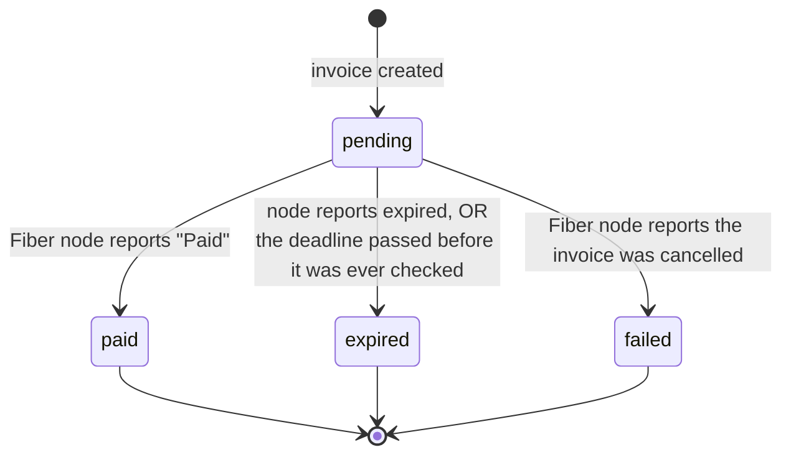

# Architecture

## Overview

Everything above talks over the Docker internal network — nothing is publicly
exposed except through the optional `nginx` TLS/WSS reverse proxy (see
[Public HTTPS deploy](/merchants/public-https-deploy)).

## Data flow — creating an invoice

## Data flow — detecting a status change

Once created, an invoice's status is picked up by one of two mechanisms running in
parallel — a real-time listener (primary) and a polling fallback (never fully
disabled):

Step (1) must run before step (2) in each polling cycle: bulk-expiring doesn't call
the Fiber node at all, it only checks the clock — running it first could mark an
invoice `expired` that was actually paid at almost the exact same moment (status
transitions are one-directional, so there's no way back from `expired` to `paid`
once that happens).

## Data flow — webhook delivery

Each webhook endpoint signs with its own secret (not a single global signing key),
and retries follow a fixed schedule (`immediate → 1 minute → 5 minutes`) rather than
exponential backoff.

## Invoice status lifecycle

Status only ever moves in one direction — there's no path back to `pending`, or
from one terminal state to another. In particular, once an invoice is marked
`expired`, it stays `expired` even if the underlying Fiber payment somehow settles
afterward (the protocol itself doesn't enforce invoice expiry at the payee side —
see [Decisions & trade-offs](/decisions-and-tradeoffs) for how this edge case is
currently handled).

| Status | Set when |
|---|---|
| `paid` | The Fiber node confirms the payment actually settled (not just received) |
| `expired` | Either the node reports it, or the deadline passed before a check ever happened |
| `failed` | The Fiber node reports the invoice was cancelled |
