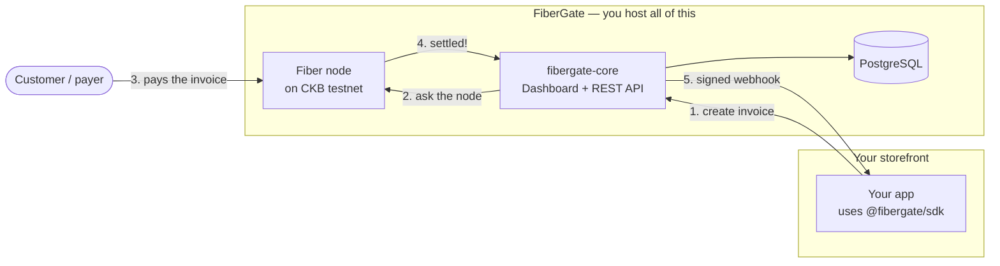

# What is FiberGate?

FiberGate lets a merchant accept payments over the [Fiber Network](https://www.fiber.world/)
(built on the CKB blockchain) from their own server — a dashboard to watch the money come in,
a REST API and SDK to create invoices, and webhooks to tell your app the moment a customer pays.

You run it yourself. One `docker compose up -d` brings up everything you need, and every payment
flows through infrastructure you own and control.

> 🖼️ `<TODO>` — *The FiberGate dashboard Overview page (the "hero" shot for this intro).*

## The problem it solves

Accepting Fiber payments the hard way means doing all of this yourself:

- **Run a Fiber node** and keep it online and funded.
- **Manage channel liquidity** so payments can actually route to you.
- **Hand-write JSON-RPC calls** to create invoices and poll for their status.
- **Build your own state machine** for pending → paid → expired, plus retries and edge cases.
- **Deliver signed webhooks** to your store, with retries when they fail.

FiberGate collapses all of that into a few commands and one REST API. You bring a node key and a
domain; it handles the invoice lifecycle, real-time payment detection, the dashboard, and webhook
delivery — so your storefront only has to call an SDK.

## Who it's for, and what you get

FiberGate is **single-tenant**: one deployment serves exactly one merchant — you. There's no
sign-up, no per-customer accounts, no hosted middleman holding your funds. That keeps everything
simple and puts you in full control.

What comes in the box:

- **A dashboard** — log in with one admin password to watch invoices, channels, peers, webhook
  deliveries, and node health.
- **A REST API + TypeScript SDK** ([`@fibergate/sdk`](https://www.npmjs.com/package/@fibergate/sdk))
  — create and look up invoices from your storefront in a few lines of code.
- **Webhooks** — get a signed notification the instant an invoice is paid, expires, or fails.
- **Real-time updates** — payments are detected within seconds over a live connection to your node,
  not by slow polling.

**What FiberGate is not:** it's not a hosted SaaS, and it's not an "LSP" — it doesn't open channels
or provide liquidity on anyone's behalf. It sits on top of a node *you* already run and fund. (More
on why in [Decisions & trade-offs](decisions-and-tradeoffs.md).)

## A few words you'll see a lot

You don't need to be a Fiber expert to use FiberGate, but four terms show up everywhere. The
[Glossary](glossary.md) has the full list — here's the short version:

- **Node** — the piece of software that actually speaks the Fiber protocol and holds your funds.
  FiberGate runs one for you and talks to it so you don't have to.
- **Channel** — a direct payment link between your node and another. Money moves through open
  channels instantly and off-chain; you need a channel with enough *inbound* room to receive a
  payment.
- **Invoice** — a payment request for a specific amount. You hand its address to a customer, they
  pay it, and it settles into your channel.
- **Webhook** — a message FiberGate sends to your store's URL when something happens (like
  "this invoice was paid"), signed so you can trust it really came from your gateway.

## How it works

When a customer buys something, here's the round trip:

1. Your storefront asks FiberGate to **create an invoice** for the amount owed.
2. FiberGate asks your **Fiber node** to mint it and returns an invoice address.
3. The customer **pays that address** from any Fiber wallet.
4. Your node settles the payment; FiberGate notices **within seconds** over a live subscription
   (with a 30-second poller as a safety net).
5. FiberGate marks the invoice **paid**, records it, and fires a **signed webhook** back to your
   store — which flips the order to "paid" with no page refresh.

## Where to go next

- **Just want it running?** → [Quickstart for merchants](merchants/quickstart.md) — three commands.
- **Want to follow the whole journey** — deploy, tour the dashboard, take your first payment, and
  watch it land live? → [Merchant walkthrough](merchants/walkthrough.md).
- **Want to see what the dashboard looks like?** → [Dashboard tour](merchants/dashboard-tour.md).
- **Curious why it's built this way?** → [Decisions & trade-offs](decisions-and-tradeoffs.md).
