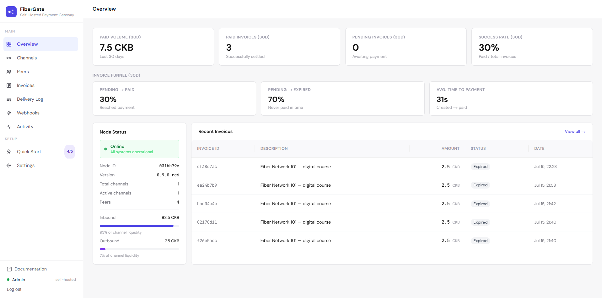
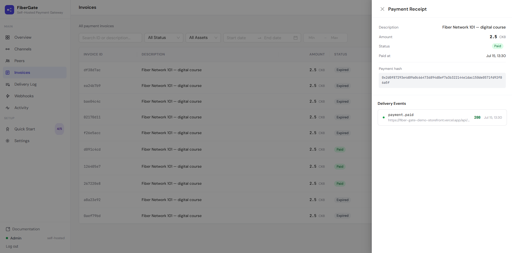
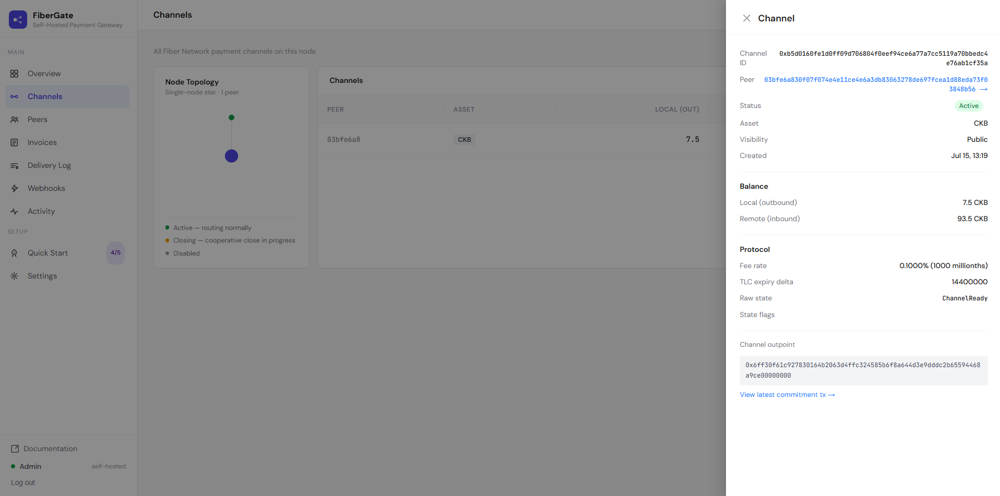
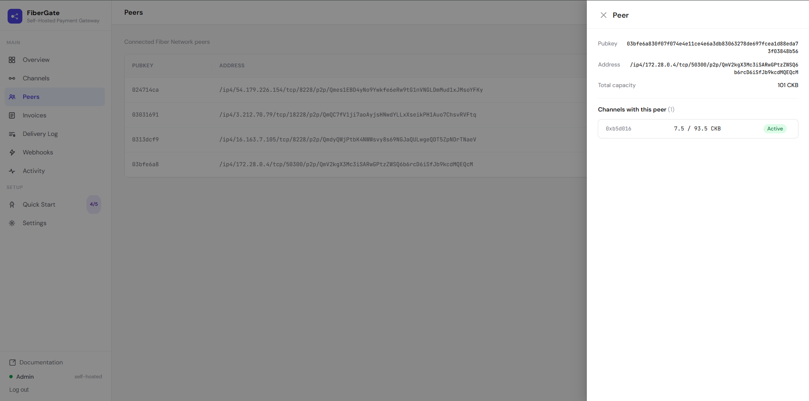
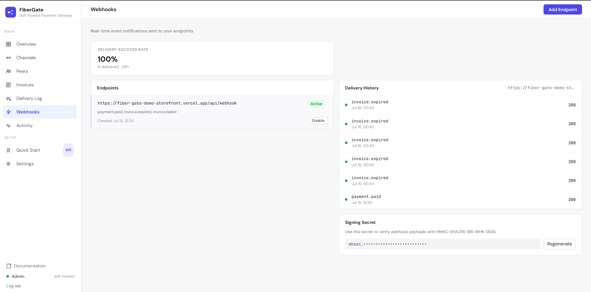
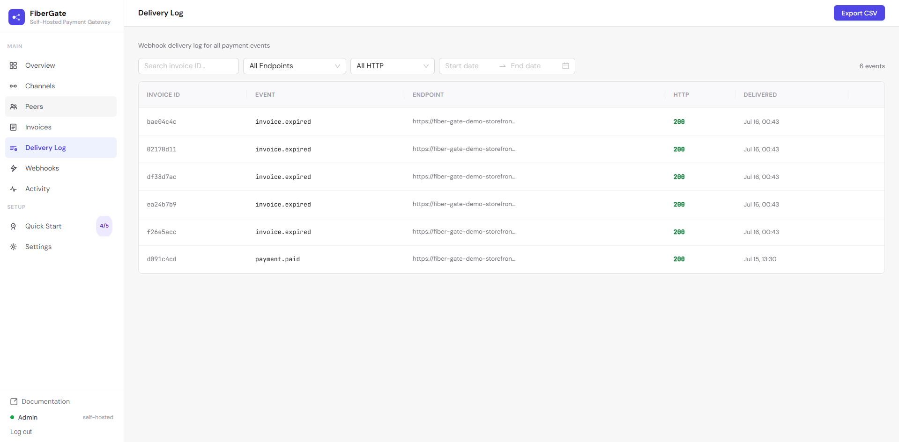
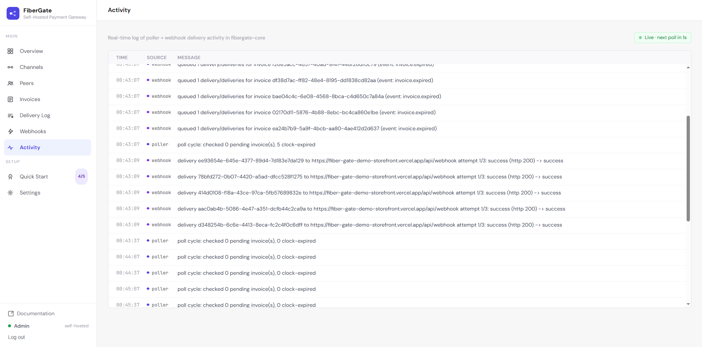
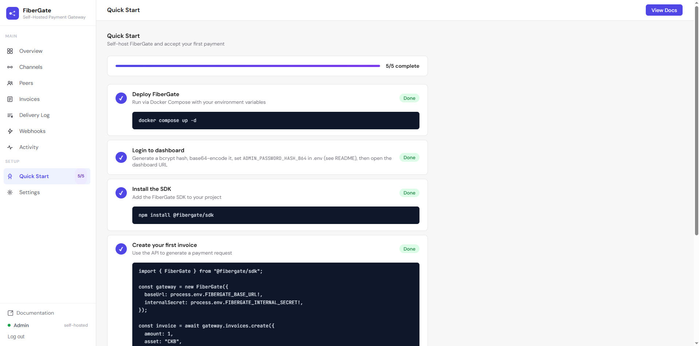
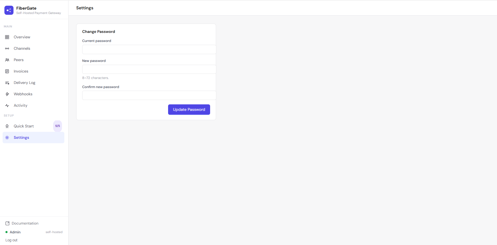

# Dashboard tour

A quick look at every page in the FiberGate dashboard — what it's for, what you do there, and what
you see. If you're setting up for the first time, the [Merchant walkthrough](walkthrough.md) puts
these in order; this page is the reference you come back to.

You reach the dashboard at `http://<your-host>:3000` (or `https://<your-domain>` after
[public HTTPS setup](public-https-deploy.md)) and log in with your admin password. Everything below
lives behind that single login.

## Overview

Your home screen — a live health check for the whole operation.

**You see:** paid volume and paid-invoice counts for the last 30 days, pending invoices, and your
success rate, plus an invoice funnel (how many pending invoices convert vs. expire, and the average
time to payment). Alongside it, a **Node Status** panel: online / degraded / offline, your node ID
and version, channel and peer counts, and bars showing how much you can currently send and receive.

**You do:** nothing to change — it's read-only monitoring. Each panel degrades on its own if one data
source is briefly unavailable, so a hiccup in one area won't blank the whole page.

## Invoices

Your complete payment ledger.

**You see:** every invoice with its status, amount, asset, and timestamps.

**You do:** filter by status or asset, search by description / payment hash / id, narrow by date or
amount range, and page through the results. Open any row for a **Receipt drawer** — full invoice
detail plus that invoice's webhook delivery history, with a download button. **Export to CSV** pulls
exactly the rows your current filters and search match, not just the visible page.

## Channels

The payment links between your node and others — this is your liquidity at a glance.

**You see:** a star **topology** diagram with your node in the middle and one dot per peer, colored by
channel state, plus a table of every channel (capacity, state, asset).

**You do:** click a channel to open a drawer with its local and remote balances, in-flight amounts,
state, and commitment transaction hashes — and a "View peer →" link that jumps to that peer.

## Peers

The nodes yours is connected to.

**You see:** a table of peers with their public key and network address.

**You do:** open a peer to see all the channels you share with it and their total capacity —
deep-linked to and from the Channels page, so you can trace liquidity from either direction.

## Webhooks

Where you manage the notifications FiberGate sends your store.

**You see:** your delivery success rate and a "needs attention" card flagging the worst-failing
endpoint, then your list of endpoints.

**You do:** **Add Endpoint** (an `https://` URL plus the events you want — `payment.paid`,
`invoice.expired`, `invoice.failed`), enable or disable an endpoint, view its delivery history, and
manage its **signing secret**. The secret is shown in full **exactly once** when created or
regenerated — copy it then; afterward it's masked.

## Delivery Log

Every webhook attempt, everywhere, in one place.

**You see:** each delivery joined with its endpoint URL — HTTP status, response, attempt count, and
when the next retry is due.

**You do:** filter by endpoint, status, search, or date, and **retry** a failed delivery by hand. It's
append-only: a resend creates a new row rather than overwriting history, so the audit trail stays
intact.

## Activity

A live feed of what the gateway's background workers are doing.

**You see:** poller and webhook activity streaming in, color-coded by source, with errors highlighted
and a "Live · next poll in Ns" pill. This is the page to keep open while you test a payment — it's
where a settlement shows up the instant it happens.

**You do:** just watch. The feed auto-refreshes every few seconds. It's an in-memory buffer, so it
resets when the container restarts (the durable record is the Delivery Log and the Invoices ledger).

## Quick Start

A built-in, self-checking onboarding checklist.

**You see:** five steps — deploy, log in, install the SDK, create your first invoice, configure a
webhook and test a payment — each with copy-paste code.

**You do:** work through them. Steps are ticked off automatically where FiberGate can tell from your
real data (for example, once you actually have a paid invoice and an active webhook endpoint). The
sidebar shows your progress as "N/5".

## Settings

**You see / do:** change your dashboard admin password. The new password is stored (hashed) in the
database and takes over from the one you set at scaffolding time — no need to edit any env file.

