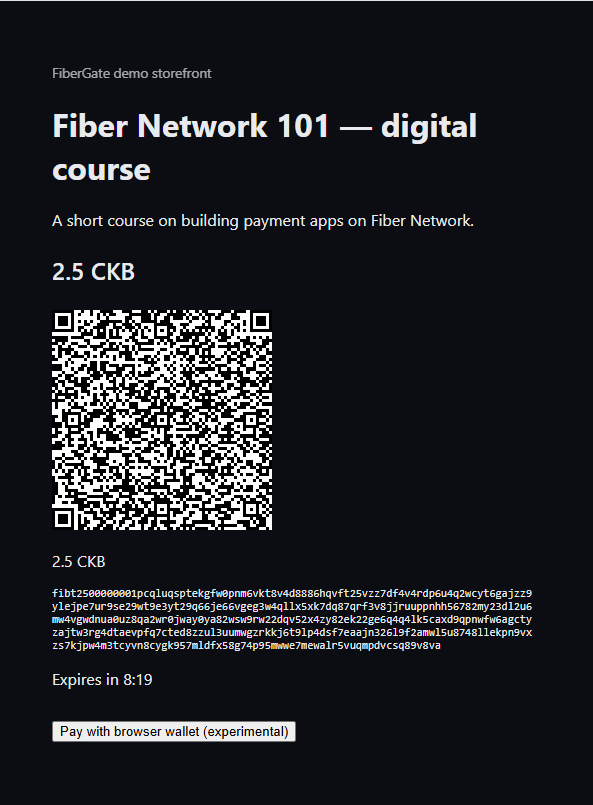
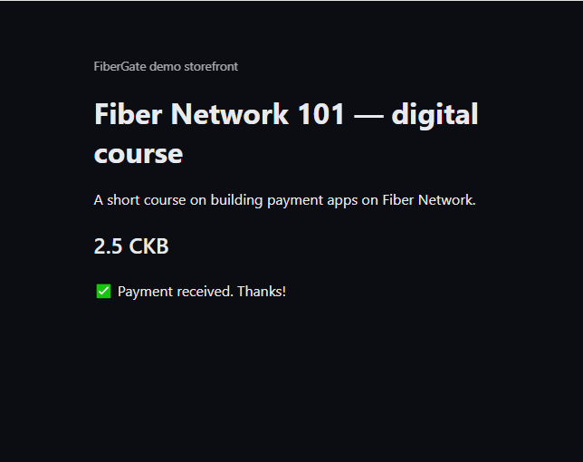

# Demo storefront

The demo storefront is a small reference app that shows how a real merchant integrates with
FiberGate. It's a mock shop selling one digital product, and it's built as a **genuinely separate
app** — it shares no code with FiberGate itself and runs as its own process.

It integrates the way any third-party store would:

- It creates an invoice through [`@fibergate/sdk`](https://www.npmjs.com/package/@fibergate/sdk),
  which makes a real API call to your gateway.
- It renders the returned invoice address as a **QR code**.
- When the invoice is paid, it receives a **signed webhook**, verifies the signature with the SDK,
  and pushes the update to the open browser tab over Server-Sent Events — so the page flips to "paid"
  with no refresh and no polling.

If you followed the [Merchant walkthrough](walkthrough.md), this is the app used in its "See it live"
step.



::: details "Pay with browser wallet" — an extra testing shortcut
Once an invoice is showing, there's also an experimental **"Pay with browser wallet"** button. It
runs an actual Fiber node in the browser (via WebAssembly) so you can pay without a separate wallet
or node. It exists to speed up manual testing — it isn't part of the "integrates like a real
merchant" story that the QR code demonstrates. Two known caveats, not yet verified against a live
setup:

- The browser wallet can only reach peers over `wss://` (browsers can't open raw TCP). Your node has
  a WSS path once a real domain is configured — see [Public HTTPS deploy](public-https-deploy.md).
- The browser-wallet library targets Fiber `v0.9.0-rc4`; the node here is pinned to `v0.9.0-rc6` —
  likely fine, not confirmed.
:::

## Try it locally

1. **Bring up FiberGate** the usual way (`pnpm docker:dev`, migrate, fill in the root `.env`) — see
   [Getting started (contributor / local dev)](../maintainers/getting-started.md).
2. **Register a webhook** in the dashboard: **Webhooks → Add Endpoint**, pointing at the storefront's
   receiver (`http://localhost:3001/api/webhook`) with the `payment.paid` event. Copy the signing
   secret it shows you — you'll need it in the next step.
3. **Configure the storefront.** Copy `apps/demo-storefront/.env.example` to
   `apps/demo-storefront/.env.local` and fill in two values: `FIBERGATE_INTERNAL_SECRET` (the same
   value as your root `.env`) and `DEMO_WEBHOOK_SECRET` (the signing secret from step 2). This app
   deliberately doesn't read the root `.env`, just like a real separate merchant app wouldn't.
4. **Start both apps**, each in its own terminal:
   ```bash
   pnpm dev                                 # fibergate-core, :3000
   pnpm --filter demo-storefront dev        # demo storefront, :3001
   ```
5. **Open the store** at `http://localhost:3001` and click **Buy now**. A QR code appears for the
   invoice. Pay it from a Fiber testnet wallet that has an open channel to your node — or, if you
   don't have one handy, use the throwaway payer node in
   [Paying a demo invoice locally](../maintainers/local-testing.md). The page updates itself the
   moment the webhook is verified.



## Running it via Docker Compose

The storefront has its own compose overlay, and it's **not** part of the merchant-facing bundle — a
plain `docker compose up -d` (root file alone) never starts it. It reads its secrets from
`apps/demo-storefront/.env.local` (step 3 above), not the root `.env`, so create that file first even
if you skip local dev and go straight to Docker.

To bring up all four containers together, from the repo root:

```bash
docker compose -f docker-compose.yml -f apps/demo-storefront/docker-compose.demo.yml up -d
```

Want to pay a demo invoice without a separate wallet or node? See
[Paying a demo invoice locally](../maintainers/local-testing.md) — a contributor/testing tool (a
second throwaway node), not something a merchant or integrator needs to understand.

Something not working? See [Troubleshooting](../common/troubleshooting.md).
