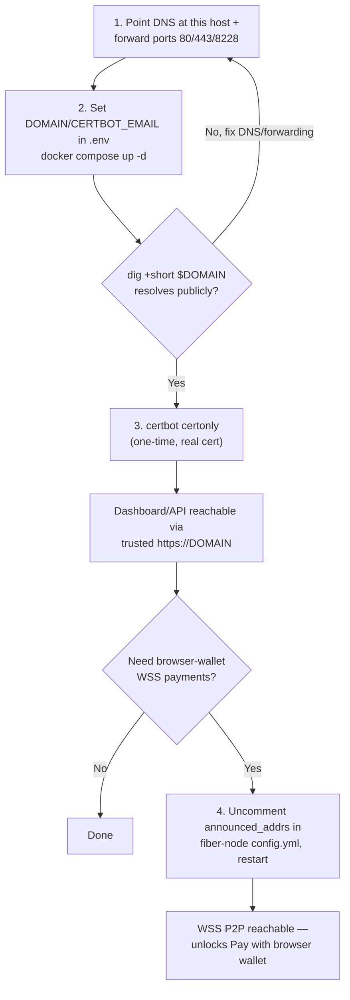

# Public HTTPS deploy

Fronts `fibergate-core`'s dashboard/API and `fiber-node`'s P2P port with TLS via an
`nginx` + `certbot` (Let's Encrypt) service pair, folded directly into
`docker-compose.yml` — a plain `docker compose up -d` requires `DOMAIN` and
`CERTBOT_EMAIL` set in `.env` to become fully reachable over HTTPS. Two things
become reachable once this is fully set up:

- a trusted `https://$DOMAIN` for the dashboard/API — useful for judges/customers
  trying a hosted demo
- WSS for `fiber-node`'s P2P port — unlocks the demo storefront's
  ["Pay with browser wallet"](demo-storefront.md) button

Nginx boots even without a real cert (a temporary self-signed one, generated by
`nginx-certs-preflight` if none exists yet), so `docker compose up -d` always comes
up — but a trusted `https://` URL needs the steps below completed against a real,
publicly-resolvable domain.



## 1. Get a domain and point it at this host

Any domain works — a domain you already own, or a free subdomain from any provider
that supports it. Once you have one:

- Point its DNS A/AAAA record at this host's public IP.
- Forward ports **80**, **443**, and **8228** on your router/firewall to this
  machine's LAN IP. All three are used by `nginx`: 80 for the ACME HTTP-01 challenge
  + HTTPS redirect, 443 for the dashboard/API, 8228 for `fiber-node`'s P2P/WSS
  traffic.
- **If your registrar/DNS is Cloudflare: keep this record DNS-only ("grey cloud"),
  not Proxied ("orange cloud").** Proxied mode terminates TLS at Cloudflare's edge
  and doesn't forward arbitrary TCP ports like 8228 on the free/pro plan — the WSS
  path for the browser wallet wouldn't be reachable through it. DNS-only means
  Cloudflare is just answering DNS queries, no different from any other registrar.
- Confirm it actually resolves from outside your network before continuing —
  `dig +short $DOMAIN` from a machine that isn't this one, or any public "DNS
  checker" website.

## 2. Configure and start

Set `DOMAIN` and `CERTBOT_EMAIL` either when prompted during
[`npx create-fibergate@latest`](quickstart.md), or by editing them directly in
`.env` after the fact:

```bash
# In .env:
DOMAIN=your-subdomain.example.com
CERTBOT_EMAIL=you@example.com   # Let's Encrypt expiry notices

docker compose up -d
docker compose ps   # nginx-certs-preflight should show "Exited (0)", nginx "running"
```

## 3. Get a real certificate (one-time)

Only run this once DNS + port-forwarding from step 1 are actually live — Let's
Encrypt needs to reach port 80 on this host from the public internet:

```bash
docker compose run --rm certbot certonly \
  --webroot -w /var/www/certbot \
  -d "$DOMAIN" --email "$CERTBOT_EMAIL" --agree-tos --no-eff-email

docker compose exec nginx nginx -s reload
```

The `certbot` service keeps running afterward and renews automatically (checks
twice daily; Let's Encrypt certs are valid 90 days, renewed around day 60) — nginx
reloads itself every 6h to pick up renewed certs, so no manual reload is needed
again after this first one.

Verify:
```bash
curl -I https://$DOMAIN   # should return a real response (e.g. a redirect to /login),
                           # no -k/--insecure needed once the cert is trusted
```
Log into the dashboard through this URL and check the response's `Set-Cookie` header
for the `Secure` attribute (browser dev tools' Application/Storage tab, or `curl -v`
on the login request) — confirms `X-Forwarded-Proto` is being forwarded and read
correctly end to end.

## 4. Enable WSS for fiber-node (unlocks the browser wallet button)

Optional — only needed for the demo storefront's "Pay with browser wallet" button.
Skip this if you only care about the dashboard/API being on HTTPS.

1. Edit `docker/fiber-node/config.yml`'s `announced_addrs` — uncomment the
   `/dns4/...` line already there and replace `YOUR-DOMAIN` with your real `DOMAIN`.
2. `docker compose restart fiber-node`.
3. Verify the node's pubkey and that a peer can connect through the WSS path (from
   this host, since `fiber-node`'s RPC stays loopback-only):
   ```bash
   curl -s -X POST http://127.0.0.1:8227 \
     -H "Content-Type: application/json" \
     -d '{"id": 1, "jsonrpc": "2.0", "method": "node_info", "params": []}' | jq -r '.result.pubkey'
   ```
   Full connect/verify flow (from a separate node or the browser wallet itself) is
   in the official guide this setup is adapted from: `nervosnetwork/fiber`'s
   `docs/fiber-node-wss.md` (pinned to tag `v0.9.0-rc6`, matching this project's
   pinned `nervos/fiber` image).

**Not yet verified against a real domain as of this writing** — this setup was built
and smoke-tested locally (self-signed cert, `DOMAIN=localhost`) but not against real
Let's Encrypt issuance or a live browser-wallet payment. Both are next steps once a
real domain is live.

Something not working? See [Troubleshooting](../common/troubleshooting.md).
