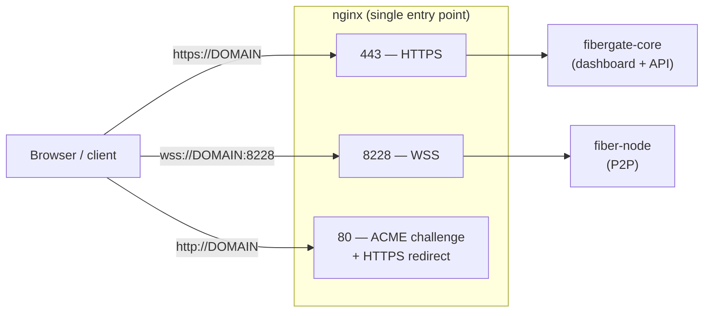
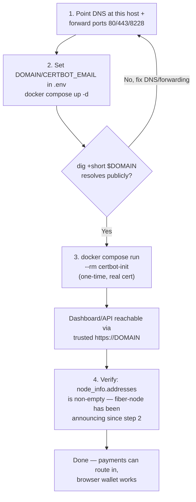

# Public HTTPS deploy

Want a real `https://` address that customers or judges can reach? This puts a TLS reverse proxy
(nginx + Let's Encrypt via certbot) in front of your gateway. It's already built into the compose
file — you just supply a domain and a couple of settings in `.env`.

Once it's set up, two things become reachable:

- a trusted `https://your-domain` for the dashboard and API — handy for a hosted demo
- WSS for your node's P2P port — which unlocks the demo storefront's
  ["Pay with browser wallet"](demo-storefront.md) button

**What you'll need:** a domain you control, pointed at this host, with ports 80/443/8228 forwarded to
it.



Nginx boots even without a real cert (a temporary self-signed one, generated by
`nginx-certs-preflight` if none exists yet), so `docker compose up -d` always comes
up — but a trusted `https://` URL needs the steps below completed against a real,
publicly-resolvable domain.



## 1. Get a domain and point it at this host

Any domain works — a domain you already own, or a free subdomain from any provider
that supports it. Once you have one:

- Point its DNS A/AAAA record at this host's public IP.
- Forward ports **80**, **443**, and **8228** on your router/firewall to this
  machine's LAN IP. All three are used by `nginx`: 80 for the ACME HTTP-01 challenge
  + HTTPS redirect, 443 for the dashboard/API, 8228 for `fiber-node`'s P2P/WSS
  traffic.
::: warning Using Cloudflare (or any CDN proxy)? Port 8228 will not survive it
If your DNS record has Cloudflare's proxy switched on (the orange cloud), the name
resolves to Cloudflare rather than to your host, and Cloudflare forwards only a fixed
set of HTTP/HTTPS ports. **8228 is not one of them**, so `fiber-node` ends up
announcing an address no peer can dial — while your dashboard on 443 works perfectly,
which makes it look like everything is fine.

Add a second record for the same host with the proxy **off** ("grey cloud") — e.g.
`fiber.your-domain` — and put it in `.env` as `FIBER_P2P_DOMAIN`.

One catch for step 3 below: if your CDN has something like Cloudflare's "Always Use
HTTPS" turned on, the ACME challenge on port 80 is redirected to 443 — and nginx's
`:443` server block only proxies to the dashboard, it has no
`/.well-known/acme-challenge/` location (only the `:80` block does). First issuance
then fails for a reason nothing reports clearly. Either turn the proxy off for the
one-time `certbot-init` run and back on afterwards, or use a DNS-01 challenge. Your dashboard keeps
the apex record and its CDN protection; only P2P bypasses it. `certbot-init` in step 3
picks that name up and includes it in the certificate, so the WSS address keeps
validating.
:::

- Confirm it actually resolves from outside your network before continuing —
  `dig +short $DOMAIN` from a machine that isn't this one, or any public "DNS
  checker" website.

::: warning Using Cloudflare?
Keep this record **DNS-only ("grey cloud")**, not Proxied ("orange cloud"). Proxied
mode terminates TLS at Cloudflare's edge and doesn't forward arbitrary TCP ports like
8228 on the free/pro plan — the WSS path for the browser wallet wouldn't be reachable
through it. DNS-only means Cloudflare is just answering DNS queries, no different
from any other registrar.
:::

## 2. Configure and start

Set `DOMAIN` and `CERTBOT_EMAIL` either when prompted during
[`npx create-fibergate@latest`](quickstart.md), or by editing them directly in
`.env` after the fact:

```bash
# In .env:
DOMAIN=your-subdomain.example.com
CERTBOT_EMAIL=you@example.com   # Let's Encrypt expiry notices

docker compose up -d
docker compose ps   # nginx-certs-preflight should show "Exited (0)", nginx "running"
```

## 3. Get a real certificate (one-time)

Only run this once DNS + port-forwarding from step 1 are actually live — Let's
Encrypt needs to reach port 80 on this host from the public internet:

```bash
docker compose run --rm certbot-init

docker compose exec nginx nginx -s reload
```

`certbot-init` reads `DOMAIN`/`CERTBOT_EMAIL` straight from `.env` (same values you
set in step 2) — there's nothing to fill in or substitute yourself. It's a separate,
one-time-only service from the always-running `certbot` service; see
`docker-compose.yml`'s comments on both if you're curious why they're split.

The `certbot` service keeps running afterward and renews automatically (checks
twice daily; Let's Encrypt certs are valid 90 days, renewed around day 60) — nginx
reloads itself every 6h to pick up renewed certs, so no manual reload is needed
again after this first one.

::: warning Changed DOMAIN after nginx already started once?
A plain `docker compose exec nginx nginx -s reload` is **not** enough. `nginx.conf`
is only generated from `nginx.conf.template` via `envsubst` once, at container
startup — reload just re-reads the already-generated file, it doesn't regenerate
it. If you change `DOMAIN` in `.env` after `nginx` has already been created once
(e.g. you switched domains, or bought a real domain after first testing with a
placeholder), run this instead so the container re-reads `.env` and regenerates
`nginx.conf` pointing at the right cert path:

```bash
docker compose up -d --force-recreate nginx
```
:::

Verify:
```bash
curl -I https://$DOMAIN   # should return a real response (e.g. a redirect to /login),
                           # no -k/--insecure needed once the cert is trusted
```
Log into the dashboard through this URL and check the response's `Set-Cookie` header
for the `Secure` attribute (browser dev tools' Application/Storage tab, or `curl -v`
on the login request) — confirms `X-Forwarded-Proto` is being forwarded and read
correctly end to end.

## 4. Verify your node is actually on the Fiber network

Nothing to configure in this step — `fiber-node` announces itself automatically from
the `DOMAIN` you set in step 2, in both forms at once: `/dns4/<DOMAIN>/tcp/8228` for
native Fiber peers and `/dns4/<DOMAIN>/tcp/8228/wss` for browser/WASM wallets (which
is what powers the demo storefront's ["Pay with browser wallet"](demo-storefront.md)
button). `nginx` already serves both on port 8228 and tells them apart by itself.

But do check it landed, because the failure mode is silent — a node that announces
nothing looks perfectly healthy from the outside while the whole network quietly
refuses it:

```bash
curl -s -X POST http://127.0.0.1:8227 \
  -H "Content-Type: application/json" \
  -d '{"id": 1, "jsonrpc": "2.0", "method": "node_info", "params": []}' \
  | jq '{pubkey: .result.pubkey, addresses: .result.addresses}'
```

(From this host — `fiber-node`'s RPC stays loopback-only.) `addresses` must be
non-empty and list both entries. If it comes back `[]`, your node is announcing
nothing, is being banned by every peer it meets, and cannot be paid — see
[Troubleshooting](../common/troubleshooting.md) for the step-by-step fix.

::: warning The /wss half needs a real cert
Native Fiber peers use the plain-TCP address and work as soon as step 2 is done. The
WSS address is announced from that same moment, but browsers will refuse it until
step 3 has replaced the self-signed placeholder with a real Let's Encrypt cert.
:::

The full connect/verify flow from a separate node or the browser wallet itself is in
the official guide this setup is adapted from: `nervosnetwork/fiber`'s
`docs/fiber-node-wss.md` (pinned to tag `v0.9.0-rc6`, matching this project's pinned
`nervos/fiber` image).

::: info What has and hasn't been proven end to end
The WSS transport is verified against a real domain and a real Let's Encrypt
certificate: the TLS handshake passes hostname verification, and a WebSocket upgrade
on port 8228 returns `HTTP/1.1 101 Switching Protocols` proxied through to
`fiber-node`. A native Fiber node from outside the network also connects over the
plain-TCP address and holds the connection.

What is still unverified is a real browser wallet completing an actual payment over
that transport — everything underneath it now checks out, but the wallet itself
hasn't been driven end to end.
:::

Something not working? See [Troubleshooting](../common/troubleshooting.md).
