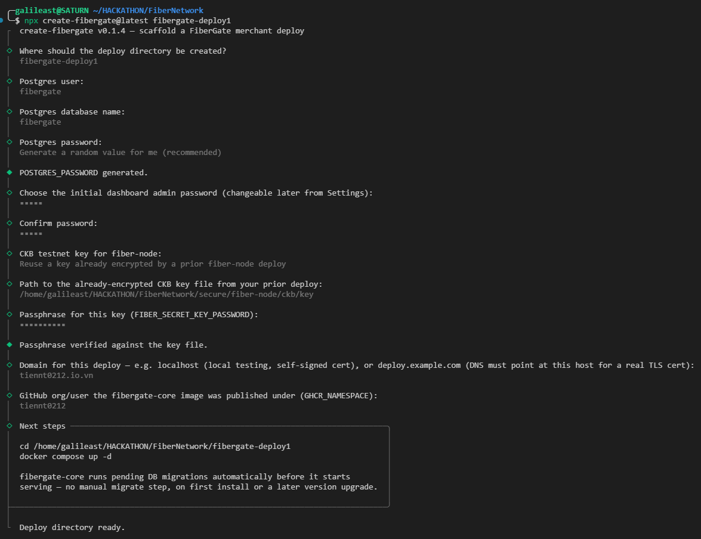
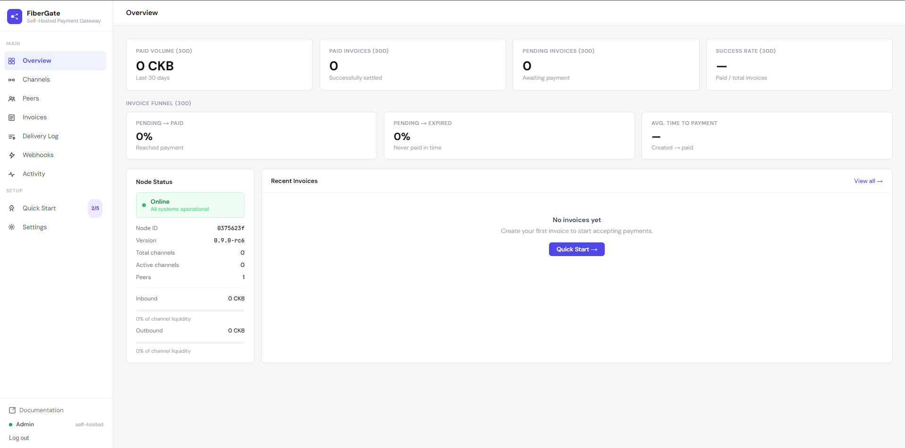

# Quickstart for merchants

Get a FiberGate deployment running in three commands. The scaffolding wizard writes every config
file and generates every secret for you, so you never hand-edit an env file or copy-paste a hash.

New here? [What is FiberGate?](../introduction.md) explains the pieces in two minutes. Want the full
journey (dashboard tour, first invoice, a live payment)? That's the
[Merchant walkthrough](walkthrough.md) — this page is just the fast path to a running gateway.

## What you'll need

- **Docker** (with Compose) on the machine that will host the gateway.
- A **CKB testnet signing key** for your Fiber node, plus a bit of **testnet CKB** to fund it — grab
  funds from the [faucet](https://faucet.nervos.org). (Unsure what any of this means? See the
  [Glossary](../glossary.md).)
- **Node.js** on the machine where you run the wizard. It can be your laptop — the deploy host itself
  only needs Docker (see [Manual / advanced deployment](deployment.md) if they're different
  machines).

## Run it

```bash
npx create-fibergate@latest fibergate-deploy
cd fibergate-deploy
docker compose up -d
```

That's a working local/testnet deployment.



## What the wizard asks

It's a short interview, and it never sends anything over the network:

1. **Postgres credentials** — a database user, name, and password (it can generate the password).
2. **Your dashboard admin password** — hashed locally, never transmitted.
3. **Your CKB testnet signing key** — either point it at a fresh raw-hex key to encrypt, or reuse an
   already-encrypted key from a previous deploy (its passphrase is checked offline before anything is
   written to disk, so a typo fails right here instead of as a container crash later).
4. **Your domain** and the GitHub namespace the `fibergate-core` image is published under.

Everything else — the internal API secret, the webhook encryption key, the session secret — is
generated for you and written into `.env`. You don't invent or manage any of it by hand.

::: details Which secrets does it generate, and what for?
| Secret | Purpose |
|---|---|
| `FIBERGATE_INTERNAL_SECRET` | The API key your storefront uses to call FiberGate. |
| `WEBHOOK_SECRET_ENCRYPTION_KEY` | Protects stored webhook secrets at rest. |
| `DASHBOARD_SESSION_SECRET` | Signs your dashboard login session cookie. |

Full reference for every variable: [Environment variables](../common/environment-variables.md).
:::

Once the interview is done, it writes a ready-to-run `docker-compose.yml`, a filled-in `.env`, and a
`.gitignore` into the target folder — using the published `fibergate-core` image, so there's no repo
to clone. Then `docker compose up -d` brings everything up, and `fibergate-core` runs its database
migrations automatically before it starts serving — on first install and on every later upgrade.

## After it's up

- **Open the dashboard** at `http://<your-host>:3000` (or `https://<your-domain>` once you've done
  [public HTTPS setup](public-https-deploy.md)) and log in with the admin password you just set.
- **Create your first invoice** — the easiest way is [`@fibergate/sdk`](https://www.npmjs.com/package/@fibergate/sdk)
  from your storefront; the [walkthrough](walkthrough.md) shows it in a few lines, or see the
  [API Reference](../api-reference.md) to call the REST endpoint directly.
- **Register a webhook** from the dashboard to get notified the moment an invoice is paid.



## Upgrading

Upgrading is the same command: `docker compose up -d`. The image is configured to always check for a
newer build first, and migrations run themselves on boot, so there's no separate pull or migrate step.

::: details Pinning to a specific build
By default you track `:latest`. To pin a reproducible build instead, set `FIBERGATE_CORE_TAG` in
`.env` to a specific `sha-…` tag; `docker compose up -d` then stays on that build until you change
the pin yourself. See [Manual / advanced deployment](deployment.md).
:::

## Something not covered here?

- **Want a public HTTPS domain for customers or judges to reach?** → [Public HTTPS deploy](public-https-deploy.md)
- **Want full manual control of the generated files, or Node.js isn't on the deploy host?** → [Manual / advanced deployment](deployment.md)
- **Want to see a real merchant integration end to end?** → [Demo storefront](demo-storefront.md)
- **Something failed during setup?** → [Troubleshooting](../common/troubleshooting.md)
